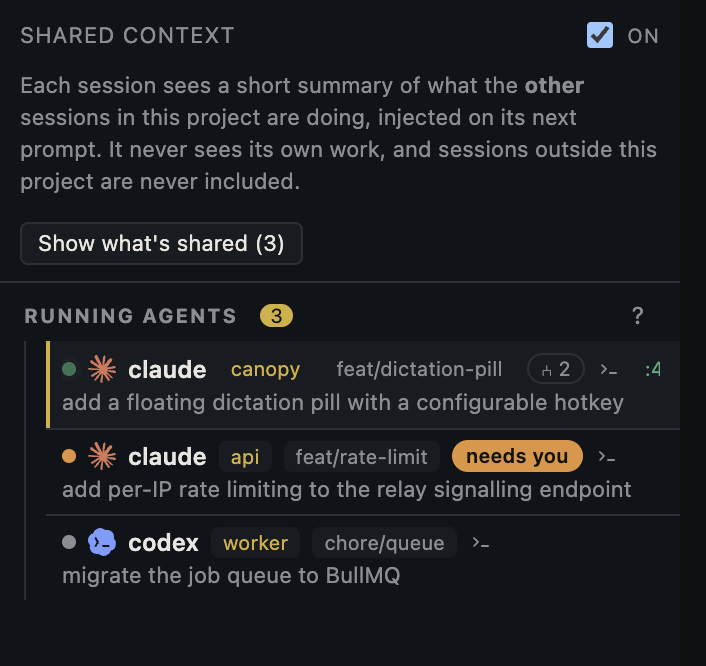
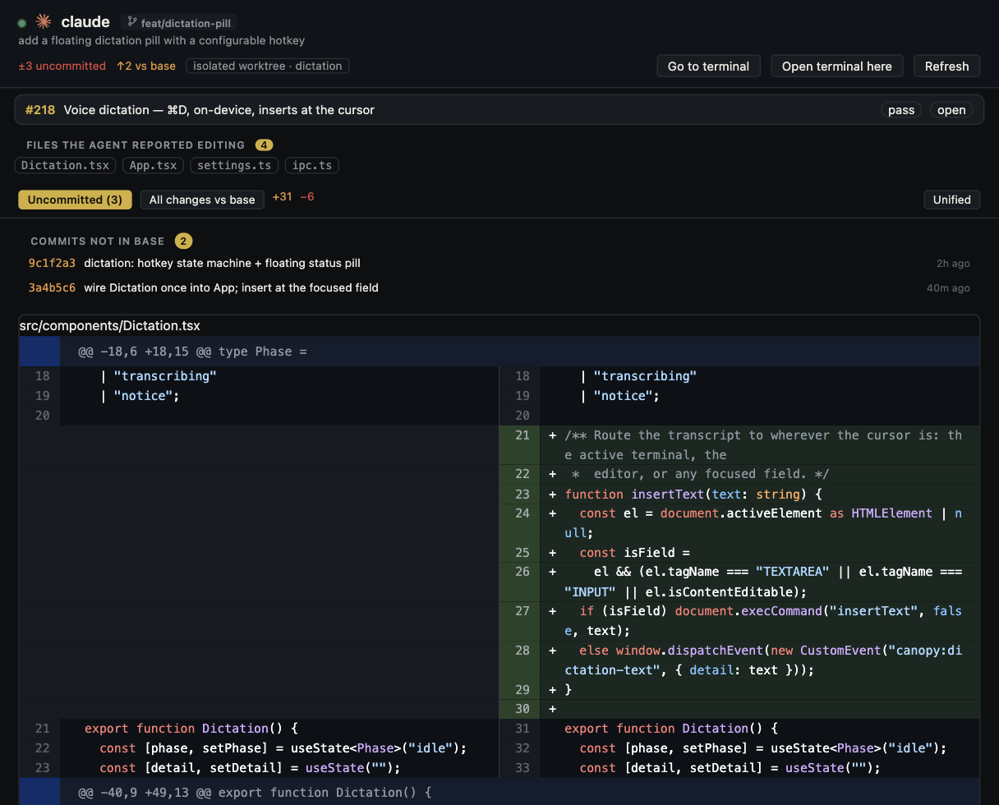
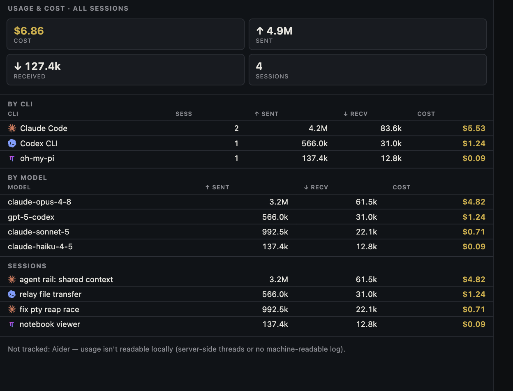
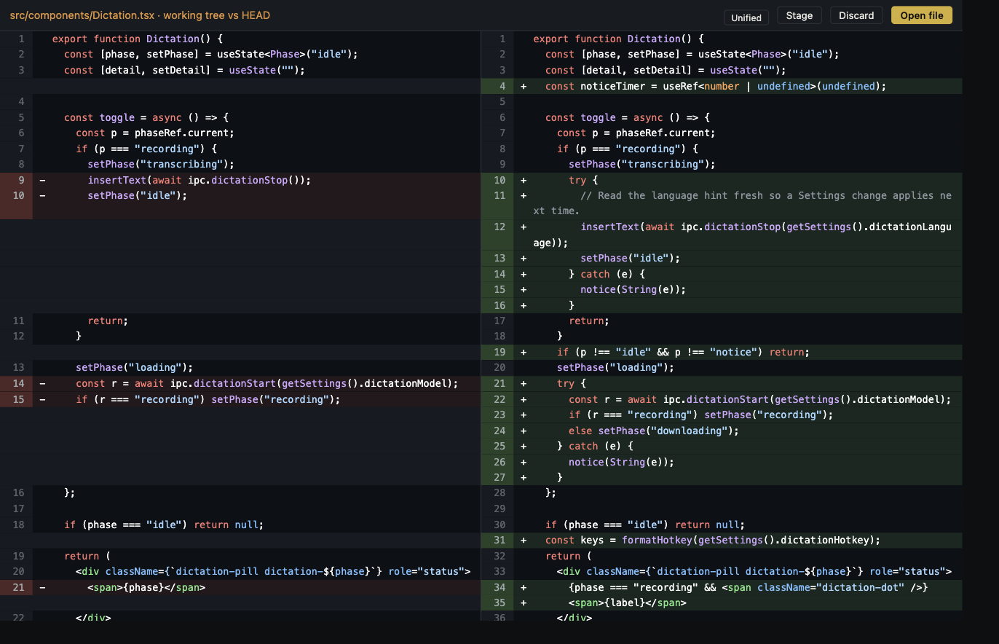
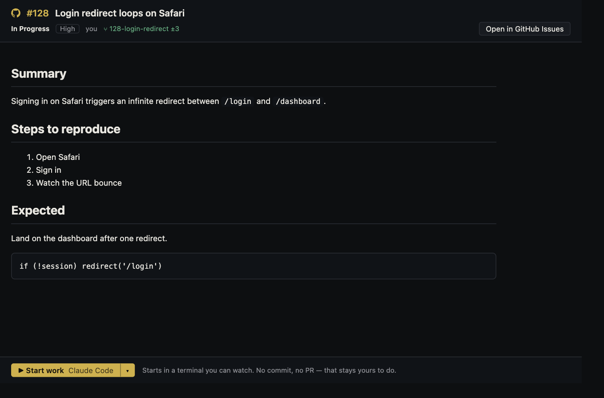
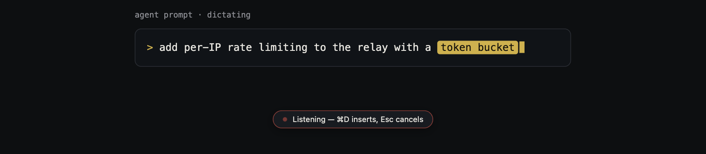
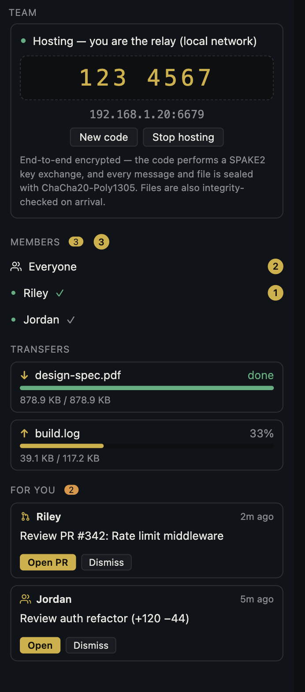
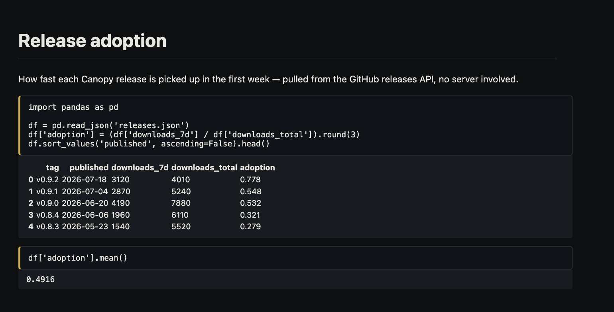

<h1 align="center">Canopy</h1>

<p align="center">
  <b>A local-first, memory-light desktop IDE for driving code with agents.</b><br>
  Run Claude Code, Codex, Aider and friends in a first-class terminal — and see
  <i>what changed</i> and <i>what's running</i>, in one native window.
</p>

<p align="center">
  <a href="https://github.com/FluidWorksApp/canopy-ide/releases/latest"></a>
  <a href="./LICENSE.md"></a>
  
  
</p>

<p align="center">
  <a href="https://canopyide.dev/"><b>canopyide.dev</b></a> ·
  <a href="https://github.com/FluidWorksApp/canopy-ide/releases/latest">Download</a>
</p>

<p align="center">
  
</p>

## What is Canopy?

Canopy is a desktop IDE built around a simple bet: the best interface for coding
with AI is the **agent's own CLI**, in a real terminal — not a chat box bolted
onto an editor. So Canopy makes the terminal first-class, then wraps it with the
two things a terminal can't show you on its own: **what changed** (live diffs
against git) and **what's running** (every agent session, its branch, its task,
its footprint).

It's **local-first and offline**: there's no server, no account, no telemetry.
Every native thing — terminals, language servers, file watchers — runs as a
child process of the app. And it's **light**: no Electron, no VS Code fork, no
extension host. The whole app, with several agents running, sits in a fraction
of the memory a browser tab would.

Built for people who let agents do the typing and want to stay in control of the
result.

## Highlights

- **Agent-native terminal.** Full TUI support — `claude`, `vim`, `htop`, `tmux`
  all just work. A launcher starts any agent CLI (Claude Code, Codex, Amp, Aider,
  Gemini, OpenCode, oh-my-pi) and offers an install command for the ones you don't have.
- **Diff-first.** When an agent edits a file under you, you get a side-by-side
  diff — never a silent reload. A git-backed Changes panel groups everything
  touched, by component.
- **Multi-project, multi-component.** Open several projects at once; each project
  spans as many labeled directories (frontend, backend, …) as you like, with
  search, terminals and git scoped per project.
- **Session awareness.** See every agent session across the project — its branch,
  the last thing you asked it, CPU/memory, and the port it's listening on.
- **A real editor.** Monaco with TypeScript diagnostics, plus native viewers for
  Markdown (incl. Mermaid), HTML, PDF, spreadsheets, Jupyter notebooks and images.
- **Dictate anywhere.** A configurable hotkey (`⌘D`) transcribes speech straight
  to the cursor — a terminal, the editor, or an agent prompt. Fully on-device
  (Parakeet / SenseVoice / Moonshine): no cloud, no upload, no formatting pass.

## A closer look

The screenshots below follow the same arc as the app itself: **run a team of
agents → review what each one produced → keep the whole stack in view → and never
leave the window for git, tickets, dictation, teammates, or files.** Every shot
is rendered straight from the real components, so the README can't drift from the
app.

**Run a team of agents — and let them share context.** Every agent CLI gets a
native tab. The agents rail shows each session's lifecycle at a glance (working /
waiting / idle), its component and branch, the last thing you asked it, and
what it needs from you. Flip *Shared context* on and each session sees a short
summary of what the others touched, injected into its next prompt.



**Review what an agent produced.** Open a session as a tab and everything it did
is in one place: the branch and worktree it works in, its uncommitted diff and
the commits it added, the files it reported editing, and the pull request raised
from that branch — the whole review, joined against git.



**See what's running — and what it costs.** Dev servers launch as native child
processes, not stray shells, and every agent session's tokens and cost roll up
per CLI, per model, and per session — so the bill never surprises you.



**Review every change.** A built-in Git panel — branches, worktrees, PRs, and
staged/unstaged changes with side-by-side diffs — and a *Loose ends* view that
measures every branch against the base and surfaces what's uncommitted,
unpushed, or safe to clean up, so nothing an agent wrote quietly disappears.



**Your tickets, in the IDE.** Pull **Linear** and **GitHub Issues** into a rail
beside the code, grouped by state. Open a ticket to read the whole thing inline,
then *Start work* — Canopy spins up a worktree on its branch and launches the
agent CLI of your choice with the ticket as its opening context. No auto-commit,
no auto-PR; that stays yours.



**Dictate anywhere.** Press `⌘D` and talk — the transcript lands wherever your
cursor is: a terminal, the editor, a commit message, an agent prompt. Speech
recognition runs entirely on your machine; nothing is uploaded.



**Build with your team, peer-to-peer.** One person hosts — their Canopy *is* the
relay — and teammates join with a code. Chat, request reviews, share a whole
project, and co-edit files live, all end-to-end encrypted (SPAKE2 join code,
ChaCha20-Poly1305 on every message and file) with no server in the middle.



**Open anything, install nothing.** Markdown (with Mermaid), CSVs, spreadsheets,
Word docs, PDFs, images, and Jupyter notebooks all render natively in the
workspace — no extensions, no marketplace, no config.



## Install

Download from [**canopyide.dev**](https://canopyide.dev/) — or on macOS:

```sh
brew install --cask fluidworksapp/tap/canopy
```

Or grab your platform directly — these links always point at the newest release:

| Platform | Download | Updates |
|---|---|---|
| macOS — Apple Silicon | [`Canopy-macos-arm64.dmg`](https://github.com/FluidWorksApp/canopy-ide/releases/latest/download/Canopy-macos-arm64.dmg) | in-app auto-update |
| macOS — Intel | [`Canopy-macos-intel.dmg`](https://github.com/FluidWorksApp/canopy-ide/releases/latest/download/Canopy-macos-intel.dmg) — no voice dictation | in-app auto-update |
| Linux — AppImage | [`Canopy-linux-x86_64.AppImage`](https://github.com/FluidWorksApp/canopy-ide/releases/latest/download/Canopy-linux-x86_64.AppImage) | in-app auto-update |
| Linux — Debian/Ubuntu | [`Canopy-linux-x86_64.deb`](https://github.com/FluidWorksApp/canopy-ide/releases/latest/download/Canopy-linux-x86_64.deb) | via your package manager |
| Linux — Fedora/RHEL | [`Canopy-linux-x86_64.rpm`](https://github.com/FluidWorksApp/canopy-ide/releases/latest/download/Canopy-linux-x86_64.rpm) | via your package manager |
| Windows — x86_64 | [`Canopy-windows-x86_64-setup.exe`](https://github.com/FluidWorksApp/canopy-ide/releases/latest/download/Canopy-windows-x86_64-setup.exe) | in-app auto-update |

All versions and release notes are on the
[releases page](https://github.com/FluidWorksApp/canopy-ide/releases). The
macOS build is signed and notarized. Prefer to build it yourself? See below.

## Prerequisites

Canopy runs out of the box, but the **agent CLIs it launches** and its **git
features** rely on two common tools. Install these once and every launcher entry
works — without them you'll hit errors like `'npm' is not recognized`.

- **Git** — Canopy is built around git (branches, worktrees, diffs, PRs).
- **Node.js 18+ (with npm)** — most agent CLIs install and run through npm
  (Claude Code, Codex, Amp, OpenCode).

**macOS**
```sh
xcode-select --install     # Git   (or: brew install git)
brew install node          # Node.js + npm
```

**Windows** — winget is built into Windows 10/11. **Open a new terminal
afterward** so `PATH` picks them up:
```powershell
winget install Git.Git
winget install OpenJS.NodeJS.LTS
```

**Linux (Debian/Ubuntu)**
```sh
sudo apt update && sudo apt install -y git nodejs npm
```
For a newer Node than your distro ships, use
[NodeSource](https://github.com/nodesource/distributions).

Some CLIs bring their own runtime — **Aider** needs Python/pip, **Antigravity**
its own installer — and Canopy's launcher shows the exact install command for
each CLI you don't have yet. The tools above are what those commands depend on.

## Build from source

Prerequisites: **Rust** (stable) and **Node 20+**. For TypeScript language
features, either `npm i -g typescript-language-server typescript` or have them in
the opened project's `node_modules`.

```sh
npm install
npm run tauri dev      # development, with hot reload (or: npx tauri dev)
npm run tauri build    # production bundle (.app / installer)
```

The first `tauri dev` compiles the Rust core and takes a few minutes; subsequent
runs are fast and the frontend hot-reloads.

## Using Canopy

- **Projects are the entry point.** Create one (＋), name it, and add one or more
  labeled component directories. Projects persist in `~/.canopy/projects.json`.
  Open several at once — top tabs switch projects, and the side panel, terminals
  and file sub-tabs are all scoped per project. The File menu also offers explicit
  *Open Project…*, *Save Project As…*, and *Open / Save Workspace* for moving a
  setup between machines or committing it to a repo.
- **The terminal is the hero.** Opening a project opens the launcher rather than a
  bare shell. Pick a shell or an agent; the terminal starts `cd`'d into the
  project. ⌫ clears scrollback; ↺ hard-resets. Scrollback is capped (10k lines,
  configurable in `localStorage` `canopy.settings`).
- **Run commands** (per component, in project settings) launch into the **RUNS
  rail** — kept apart from shells because they're services, not sessions. Each
  reports real state: a pulsing dot while live, a green check when a one-shot
  finishes, or a red exit code when it fails.
- **Quick Open (`Cmd+P`) and Find in Files (`Cmd+Shift+F`)** search every
  component of the project by default; chips scope to a single component.
- **Diff-first.** A file changed on disk gives you a side-by-side diff — Accept
  disk version / Keep mine — never a silent reload. The Changes tab lists
  everything git sees as changed, grouped by component.
- **Agents tab.** Agent CLIs detected inside your terminals, with CPU/memory
  (runaway guard) and kill buttons, plus a file-based hook bridge: any CLI hook
  system can append JSON lines to `~/.canopy/agent-events.jsonl` and they show up
  live. Claude Code hooks install automatically at boot, and only fire for
  terminals Canopy spawned.

### Keyboard shortcuts

VS Code-standard where an equivalent exists. All scoped to the active window and
visible project — `Cmd+W` closes a tab, never the app.

| Shortcut | Action |
| --- | --- |
| `Cmd+P` | Quick Open file (fuzzy) |
| `Cmd+Shift+F` | Find in Files |
| `Cmd+N` / `Cmd+O` | New project / Open project folder |
| `Cmd+Shift+O` / `Cmd+Shift+S` | Open / Save workspace file |
| `Cmd+T` | New terminal |
| `Cmd+W` | Close tab |
| `Ctrl+Cmd+←` / `Ctrl+Cmd+→` | Previous / next tab |
| `Cmd+Shift+W` | Close project |
| `Cmd+B` | Toggle sidebar |
| `Cmd+Shift+Enter` | Focus mode (`Esc` exits) |
| `Cmd+Q` | Quit |

## Contributing

Contributions are welcome — issues, ideas, and pull requests. Canopy is a small,
readable codebase and a good project to hack on.

**Get set up:** follow [Build from source](#build-from-source) above, then run
`npm run tauri dev`.

**Before you open a PR,** these should all pass:

```sh
npm run typecheck    # tsc -b (the root tsconfig is solution-style; this is the real check)
npm run lint         # oxlint
npm run build        # tsc -b && vite build
cargo build --manifest-path src-tauri/Cargo.toml
```

**Where things live:**

| Path | What |
|---|---|
| `src/` | React + Vite frontend (components, IPC wrappers, editor) |
| `src-tauri/src/` | Rust core — `pty.rs`, `lsp.rs`, `fsx.rs`, `git.rs`, `agents.rs` |
| `src-tauri/src/bin/canopy_hook.rs` | the agent-hook helper (a second binary) |
| `packages/ui/` | shared UI primitives (`@canopy/ui`) |
| `scripts/` | sidecar build + release tooling |
| `SPEC.md` | the full product spec |
| `RELEASING.md` | how signed releases are cut |

**House style:** match the surrounding code. Comments explain *constraints and
why*, not *what* — the codebase leans on this heavily, and it's part of what
keeps it approachable. Keep native process ownership in Rust; the frontend never
spawns anything itself.

## Architecture

```
┌────────────────────────── Tauri (Rust core) ──────────────────────────┐
│  pty.rs     portable-pty sessions; reader+flusher threads per PTY;    │
│             batched raw-byte streaming over ipc::Channel; ack-based   │
│             backpressure; process-group kill on teardown              │
│  lsp.rs     LSP subprocesses over stdio; Content-Length framing       │
│             parsed in Rust; JSON messages over a Channel              │
│  fsx.rs     workspace registry (multi-root scope allowlist), fs       │
│             commands, notify watchers → fs:change events              │
│  agents.rs  sysinfo process-tree monitor → pty:stats; hook bridge     │
│             tail → agent:event                                        │
└──────────────────────────────┬────────────────────────────────────────┘
                        commands + channels/events
┌──────────────────────────────┴───────────────────────── WebView ─────┐
│  React + Vite. xterm.js fed directly from the channel — no output    │
│  buffered in JS. Monaco via @codingame/monaco-vscode-editor-api so   │
│  monaco-languageclient shares the same API instance; LSP transport   │
│  is a custom MessageReader/Writer over Tauri IPC.                    │
└───────────────────────────────────────────────────────────────────────┘
```

Design rules:

- **Rust owns all native processes** (PTYs, LSP servers, watchers). JS never spawns.
- **Raw bytes end-to-end** on the PTY path; no filtering or normalization.
- **Bounded memory**: xterm scrollback capped; the PTY reader pauses when the
  WebView is behind (ack window, default 2 MB) so the kernel backpressures the
  child instead of ballooning heap.
- **Clean teardown**: closing a tab kills the whole process group and reaps the
  child; app exit kills everything.

## Dependency justification

| Dependency | Why |
|---|---|
| `portable-pty` | cross-platform PTY (the terminal core) |
| `notify` | fs watching for the diff-first workflow |
| `sysinfo` | process-tree stats for the runaway guard / agent detection |
| `libc` (unix) | process-group SIGKILL on teardown |
| `@xterm/*` | terminal renderer + required addons |
| `monaco-editor` → `@codingame/monaco-vscode-editor-api` | monaco build compatible with monaco-languageclient 10.x |
| `monaco-languageclient` + `@codingame/monaco-vscode-standalone-languages` | LSP client + monarch grammars |
| `react-resizable-panels` | the three resizable panes |
| `marked` | markdown rendering (small, sync) |
| `mermaid` | diagram blocks in markdown (lazy-loaded) |
| `xlsx` (SheetJS, cdn dist) | spreadsheet parsing (lazy-loaded) |
| `@tauri-apps/plugin-dialog` | native folder picker |
| `@tauri-apps/plugin-opener` | system-browser link from the update toast for installs that can't self-update (`.deb`/`.rpm`) |
| `sha2` | key derivation (HKDF) + file-transfer integrity hash for the team relay |
| `spake2` | turns the low-entropy join code into a strong mutually-authenticated session key (PAKE), so the relay resists eavesdropping and offline brute-force |
| `hkdf` | splits the session key into per-direction encryption keys |
| `chacha20poly1305` | AEAD sealing every relay frame and file chunk (the transport itself stays std::net — no async/TLS stack) |
| `getrandom` | OS CSPRNG for per-file-transfer key-derivation salts + identity-key seeds |
| `ed25519-dalek` | long-term identity keys for trust-on-first-use (a reused join code can't silently impersonate a teammate) |
| `hex` | encoding identity keys/signatures on the wire and in the pin store |
| `tauri-plugin-notification` (+ npm counterpart) | native notifications for team-relay chat/commands/transfers landing while the app is unfocused |

## License

Canopy is open source under the [MIT License](./LICENSE.md) — free to use,
modify, and distribute, including commercially.

Third-party components keep their own licenses — see
[THIRD-PARTY-NOTICES.md](./THIRD-PARTY-NOTICES.md). Notably, Canopy bundles
jschardet (LGPL-2.1-or-later) as a separately replaceable chunk.

Copyright 2026 Cause Connect Pte Ltd.
