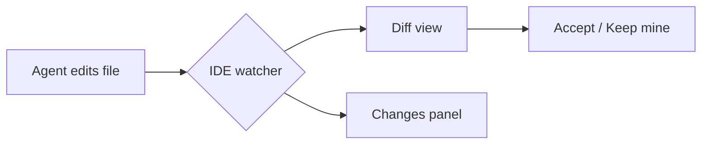

# Demo notes

This file tests the **native Markdown renderer**.

## Features

- *italics*, **bold**, `inline code`
- [links](https://example.com)
- tables:

| Feature | Status |
|---------|--------|
| Terminal | ✅ |
| Diff-first | ✅ |
| Viewers | ✅ |

## Mermaid diagram



## Code block

```typescript
export function greet(name: string): string {
  return `hello ${name}`;
}
```
