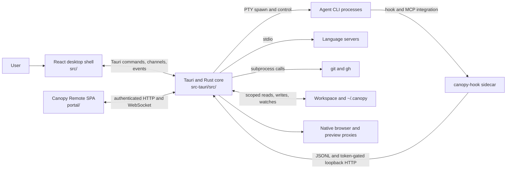
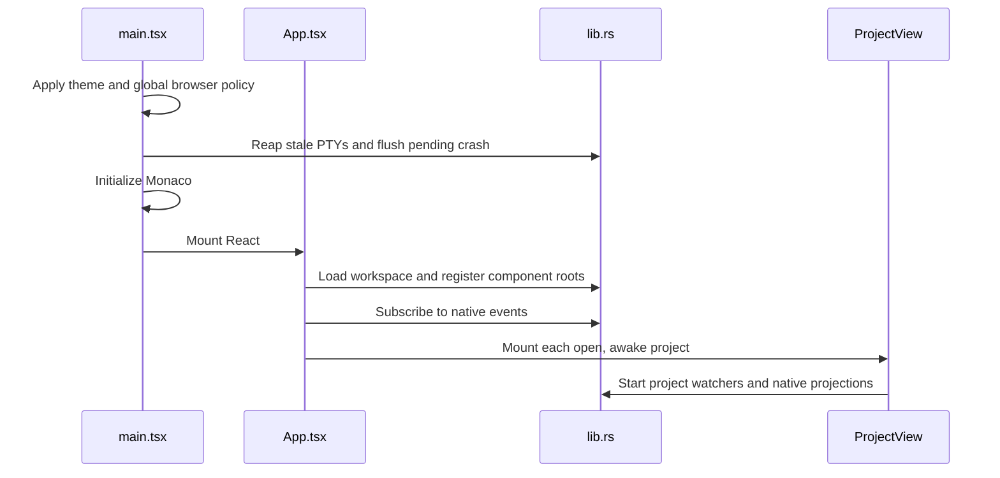
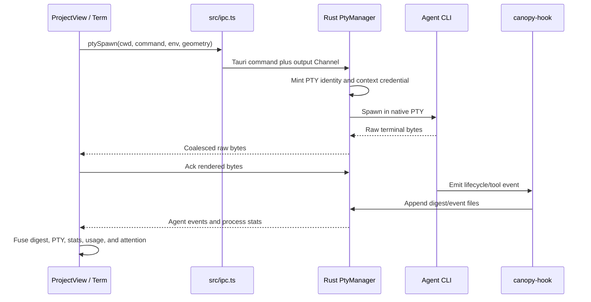

# Canopy Architecture

> Status: first architecture map for contributors. This page describes the
> implementation in the repository, not a proposed rewrite. Last verified:
> August 2026.

This page is the starting point for understanding Canopy as a system. It
explains where responsibilities live, how the main runtime paths cross process
boundaries, and which files a contributor should change for common features.

For a compact context document intended for coding agents, see
[Architecture: LLM Context](./architecture-llm.md).

For concrete contribution recipes, including messaging buses, themes, shared
components, registries, agent tools, and Remote features, see
[Contributor Integration Guide](./contributor-integrations.md).

For a module-by-module account of native ownership, managed services, process
and thread lifecycles, persistence, and security enforcement, see
[Core Rust System](./core-rust-system.md).

## 1. System in one paragraph

Canopy is a local-first desktop IDE for working with coding agents. The desktop
application is a Tauri v2 process with a React WebView. React owns presentation,
workspace composition, and transient UI state. Rust owns privileged and native
work: PTYs, child processes, files, Git, language servers, native browser views,
local servers, durable stores, and teardown. Agent CLIs run as real child
processes in Canopy-owned PTYs. A separate React application, Canopy Remote, is
built into the Rust binary and exposes a deliberately restricted view of an
open workspace over HTTP and WebSocket.

## 2. Architectural principles

These are implementation constraints, not aspirations.

1. **Rust owns native resources.** JavaScript does not spawn PTYs, language
   servers, file watchers, or agent processes. The WebView calls Tauri commands.
2. **The application is local-first.** Core editing, terminal, Git, search, and
   agent workflows do not require a hosted service.
3. **PTY data remains raw and bounded.** Rust streams bytes to xterm.js, applies
   acknowledgement-based backpressure, and caps retained scrollback.
4. **Long-lived surfaces preserve state.** Open projects, terminals, documents,
   and previously opened panels generally remain mounted while hidden.
   Hibernation is the explicit resource-release path.
5. **Durable or privileged state has one authority.** Rust and on-disk stores
   are authoritative; frontend caches are projections and are invalidated by
   events.
6. **Remote access is fail-closed.** A TypeScript feature declaration cannot
   expand the Remote attack surface. Rust must grant each command explicitly.
7. **Cross-shell behavior is shared at the model level.** Desktop and Remote use
   the same agent lifecycle, notification, file-tree, and transport contracts
   where their behavior must agree.
8. **Lifecycle cleanup is part of correctness.** Closing a surface or exiting
   the app must reap processes, threads, sockets, watchers, and temporary
   servers.

The product-level statement of these constraints is in [`SPEC.md`](../SPEC.md).

## 3. System context



There is no general application server between the desktop WebView and Rust.
Tauri IPC is the desktop boundary. The loopback and network servers described
below serve narrower purposes and have separate authentication and capability
models.

## 4. Runtime components

### 4.1 Desktop WebView

The desktop frontend is a React 19 and Vite application under `src/`.

Important entry points:

| File | Responsibility |
|---|---|
| `src/main.tsx` | Theme and global browser policy, crash forwarding, stale PTY cleanup, Monaco initialization, React mount |
| `src/App.tsx` | Application-wide workspace, project lifecycle, relay, collaboration, companion, notifications, and native event routing |
| `src/components/ProjectView/index.tsx` | One open project's tabs, terminals, editor surfaces, panels, agents, runs, previews, and feature dispatch |
| `src/components/ProjectView/helpers.ts` | Project tab and side-panel type system |
| `src/ipc.ts` | Typed wrappers over Tauri commands, channels, and events |
| `src/projects.ts` | Workspace persistence plus the agent CLI registry and launch/resume command construction |
| `src/agentOps.ts` | UI-only operations requested by agents |
| `src/browserHost.ts` | Native child-WebView geometry, visibility, occlusion, and freeze frames |

`App` mounts one `ProjectView` for each open, awake project. Inactive projects
are hidden, not unmounted, so their PTYs and editor models survive project
switches. A hibernated project is the exception: it is snapshotted, unmounted,
and later reconstructed.

`ProjectView` is the composition root for project features. It is intentionally
stateful and currently large. Most reusable business rules should live in a
framework-free module beside it rather than being added directly to this
component.

### 4.2 Rust core

The detailed native architecture is documented separately in
[Core Rust System](./core-rust-system.md). The summary below identifies the
composition root and major service boundaries.

`src-tauri/src/main.rs` delegates to `app_lib::run()` in
`src-tauri/src/lib.rs`. `run()` is the native composition root. It installs
plugins, creates managed state, starts background services, registers every
Tauri command, and shuts native resources down on exit.

Major managed services:

| Module | Native responsibility |
|---|---|
| `pty.rs` | PTY sessions, byte streaming, backpressure, scrollback, resize, process-group termination |
| `fsx.rs` | Registered workspace roots, filesystem operations, path scoping, file and Git watchers |
| `git.rs` / `sync.rs` | System `git` and `gh` operations, worktrees, branch safety, GitHub and tracker operations |
| `lsp.rs` | Language-server subprocesses and LSP stdio framing |
| `agents.rs` / `agentid.rs` | Process-tree telemetry, agent identity, hook integration installation, hook event bridge |
| `context.rs` | Token-gated loopback context and MCP bridge for agents |
| `companion.rs` | One structured app-wide companion subprocess |
| `browser.rs` | Native child WebViews and browser automation |
| `preview.rs` | Loopback reverse proxies and preview instrumentation |
| `portal.rs` / `remote/` | Canopy Remote server, authentication, protocol, capability grants, streams, and verbs |
| `relay.rs` / `wsbridge.rs` | Encrypted peer collaboration, chat, commands, and file transfer |
| `notes.rs` / `research.rs` | Project-scoped durable knowledge stores under `~/.canopy` |
| `spot.rs` / `stores.rs` | SQLite FTS index and adapters for agent transcript stores |
| `vault.rs` | Encrypted local credential vault |
| `mcp.rs` / `mcp_client.rs` | MCP discovery, redaction, connection pooling, and tool calls |
| `tunnel.rs` | Public-link provider child process |

The command registry in `src-tauri/src/lib.rs` is the authoritative list of
what the trusted desktop WebView may invoke. Adding a wrapper in `src/ipc.ts`
does not register a command; both sides must agree on the command name and
payload.

### 4.3 Agent hook sidecar

`src-tauri/src/bin/canopy_hook.rs` builds as a separate `canopy-hook` binary.
Agent CLIs invoke it without starting the full app. It writes session digests
and hook events, and it can expose Canopy's context bridge as an MCP stdio
server.

The sidecar is staged by `scripts/prepare-sidecar.mjs` because Tauri does not
automatically build the crate's second binary. It is then bundled through
`externalBin` in `src-tauri/tauri.conf.json`.

### 4.4 Canopy Remote

`portal/` is a separate React SPA, but it is not a separate npm workspace
package. The root toolchain builds it with `portal/vite.config.ts`. Rust embeds
the resulting assets and serves them under `/remote/`.

Remote uses one authenticated WebSocket for snapshots, events, PTY streams,
and generic `act`/`act-ack` RPC. The UI has separate wide and compact navigation
shells over the same panel and state model.

Remote is not equivalent to the trusted Tauri WebView. Its command surface is
the explicit `GRANTS` table in `src-tauri/src/remote/mod.rs`. Files are scoped
to registered workspace roots; write, checkout, commit, push, merge, and vault
commands are intentionally absent.

### 4.5 Shared cross-shell layer

`shared/` is source compiled by both the desktop and Remote. It must remain
browser-safe and must not import desktop state or Tauri IPC.

It contains:

- the transport-neutral domain model in `shared/model.ts`;
- agent lifecycle policy and evidence resolution in `shared/agentLife/`;
- shared hook-event and notification derivation;
- file tree, dialogs, buttons, lists, icons, and visual tokens;
- terminal transport contracts;
- the Remote feature and capability manifests in `shared/remote/`;
- the shortcut manifest consumed by both TypeScript and Rust.

Structural tests such as `shared/sharedComponents.test.ts` and
`shared/remote/registry.test.ts` enforce dependency direction and Remote grant
parity.

### 4.6 `packages/ui`

`packages/ui/` is the publishable `@canopy/ui` workspace package. It has its own
library build, declarations, and React peer dependencies.

It is important not to confuse this package with the active source-shared layer:
the desktop and Remote currently consume `shared/` directly. Changes to
`packages/ui/` do not change the applications unless their imports are migrated
explicitly.

## 5. Repository map

```text
canopy/
|- src/                         Desktop React application
|  |- components/              Project and feature UI
|  |- main.tsx                 Renderer bootstrap
|  |- App.tsx                  App-wide composition root
|  `- ipc.ts                   Typed Tauri boundary
|- src-tauri/
|  |- src/lib.rs               Rust composition root and command registry
|  |- src/bin/canopy_hook.rs   Agent hook/MCP sidecar
|  |- src/remote/              Remote grants, streams, and verbs
|  `- tauri.conf.json          Desktop build and bundle configuration
|- shared/                     Browser-safe cross-shell models and UI
|- portal/                     Embedded Canopy Remote React application
|- packages/ui/                Independently buildable @canopy/ui package
|- scripts/                    Sidecar, release, and license tooling
|- docs/                       Design notes, release notes, and this guide
|- SPEC.md                     Product constraints
|- CONTRIBUTING.md             Contributor workflow and quality gate
`- RELEASING.md                Release process
```

Tests are normally colocated with the module they protect. Generated outputs
such as `dist/`, `portal/dist/assets/`, package `dist/`, staged sidecars, and
ONNX runtime libraries are not architectural source.

## 6. Boundaries and trust model

Canopy has several boundaries with different callers. Treating them as one API
would bypass intentional security controls.

| Boundary | Caller | Transport | Authority |
|---|---|---|---|
| Desktop IPC | Bundled application WebView | Tauri invoke, Channel, event | Broad trusted command surface in `lib.rs` |
| Agent context bridge | Agent or companion child process | Bearer-token HTTP on `127.0.0.1` | Tool-specific handlers; per-PTY identity where required |
| Remote | Authenticated browser | HTTP and WebSocket | Fail-closed Rust grants with `view`, `drive`, and `admin` scopes |
| Team relay | Another Canopy instance | TCP or WebSocket | Encrypted peer protocol and application-level message types |
| Preview proxy | Preview iframe/browser | HTTP on `127.0.0.1` | Proxy and injected preview instrumentation, not general app IPC |

### 6.1 Desktop Tauri IPC

Use `src/ipc.ts` from frontend feature code. Request/response work uses
`invoke`; streaming work uses Tauri `Channel`; native-to-WebView changes use
events. Long-running native services should not be reimplemented as frontend
polling when a backend event can express invalidation.

### 6.2 Agent identity and context

Each PTY receives `CANOPY_CTX_PORT` and a unique `CANOPY_CTX_TOKEN`. Rust maps
that credential to the PTY ID, application instance, and working directory.
Identity-sensitive operations trust the credential, not a caller-supplied owner
field. A separate process-wide token supports the app-wide companion but is
anonymous and cannot impersonate a named terminal agent.

The frontend publishes IDE-only project snapshots to the bridge because open
tabs and project composition live in React. Rust supplies native state such as
PTY scrollback directly.

### 6.3 Filesystem scope

`WorkspaceManager` is the local path boundary. Registered project roots are
canonicalized, and ordinary file and Git operations resolve through those
roots. New path-taking commands should use the same scope checks. A native file
dialog or explicit import flow is a deliberate exception, not a reason to make
ordinary commands unscoped.

### 6.4 Remote grants

Remote feature manifests under `shared/remote/modules/` request capabilities.
Rust's `GRANTS` table decides what is actually reachable. A change that adds a
Remote command normally requires all of the following:

1. Declare the feature need in `shared/remote/modules/`.
2. Register the module in `shared/remote/modules/index.ts`.
3. Add an explicit least-privilege grant and dispatch handler in
   `src-tauri/src/remote/mod.rs`.
4. Add or update a panel in `portal/src/panels/`.
5. Keep registry and panel parity tests green.

## 7. State and persistence

There is no single global Redux-style store. State is placed according to its
lifetime and authority.

| State | Authority | Frontend representation |
|---|---|---|
| PTYs, process trees, LSPs, watchers, browser views | Rust managed state | IDs, snapshots, channels, and events |
| Open projects and active project | `App` plus persisted workspace | React state |
| Project tabs, terminals, open files, panel state | One `ProjectView` | React state and refs |
| Monaco text while editing | Monaco model | Metadata in project tab state |
| Notes and research | Rust file-backed stores under `~/.canopy` | Per-project caches invalidated by events |
| Agent sessions | Hook digests plus live Rust PTY evidence | Shared fused view models |
| Settings and small UI preferences | Browser `localStorage` | Module stores and subscriptions |
| SpotSearch index | Rust SQLite FTS database | Query results and ingestion status |
| Relay and collaboration | Rust relay plus app-wide collaboration manager | App-level projections and callbacks |
| Companion conversation | External agent CLI session | Module-level visual projection |
| Vault | Encrypted Rust store | Redacted metadata unless a narrow operation needs a secret |

Observable frontend modules commonly use `useSyncExternalStore`, a small
channel abstraction, or one global native-event listener. Store change events
are invalidations: consumers refetch from the authoritative store instead of
assuming the event contains complete state.

## 8. Representative flows

### 8.1 Application startup



React Strict Mode is intentionally not used at the root because a development
double mount would create and tear down real PTYs.

### 8.2 Terminal and agent lifecycle



Agent state is derived from evidence. A historical session without live
evidence is `unknown`, not optimistically `idle`. Shared lifecycle policy lives
under `shared/agentLife/` so desktop and Remote agree.

### 8.3 Agent requests an IDE operation

1. The sidecar calls the loopback context bridge using its inherited token.
2. Rust authenticates the credential and creates a ticket for UI-owned work.
3. Rust emits an agent action or browser request to the WebView.
4. `App` resolves the target project and wakes it if required.
5. The target `ProjectView` routes the operation to an existing feature path.
6. The UI returns the ticket through `browser_result`.
7. Rust resolves the waiting HTTP request.

This route is used when the answer depends on renderer-only state or a native
child WebView controlled by the renderer. Pure filesystem and native operations
can be answered directly in Rust.

### 8.4 Remote read or action

1. The user exchanges the current PIN for a session bearer token.
2. `portal/src/wire.ts` opens one WebSocket.
3. Rust sends a workspace snapshot and selected events.
4. A panel calls `portal/src/rpc.ts`, producing an `act` message with a unique
   request ID.
5. Rust rejects commands absent from `GRANTS` or above the token scope.
6. Path-taking handlers recheck workspace scope.
7. Rust sends `act-ack`; the RPC promise resolves or rejects.

Remote PTY output uses the same underlying Rust PTY session, with bounded
scrollback and live broadcast, rather than a second terminal process.

### 8.5 Notes and research

Notes and research are durable project-scoped stores under `~/.canopy`, not
files silently added to the user's repository. Mutations are serialized and
written atomically. The frontend cache refreshes after mutation or invalidation.
The SpotSearch database indexes these stores as derived data and can be rebuilt.

## 9. Extension guide

This section summarizes the extension points. The
[Contributor Integration Guide](./contributor-integrations.md) provides the
bus-selection table, exact files, examples, and verification steps.

### Add a desktop-only feature

1. Put pure domain logic in a small module under `src/` and test it directly.
2. Add presentation under `src/components/`.
3. Add a `ProjectView` tab or panel only if the feature needs project-level
   navigation or long-lived state.
4. If native work is required, add a Rust command and a typed `src/ipc.ts`
   wrapper instead of using Node or browser workarounds.

### Add a Tauri command

1. Implement the command in the owning Rust module.
2. Register it in `tauri::generate_handler!` in `src-tauri/src/lib.rs`.
3. Add a typed wrapper in `src/ipc.ts`.
4. Decide whether it needs workspace path scoping, bounded output, cancellation,
   cleanup, or event invalidation.
5. Add Rust tests for native rules and TypeScript tests for frontend behavior.

Registration in the trusted desktop command table does not expose the command
to Remote. Remote access is a separate explicit decision.

### Add a native managed service

1. Keep resource ownership in one Rust manager.
2. Register it with `.manage(...)` in `lib.rs`.
3. Define shutdown semantics before adding callers.
4. Stop it in the application exit handler.
5. Prefer bounded channels, bounded buffers, and explicit timeout behavior.

### Add a coding-agent CLI

The frontend CLI registry is in `src/projects.ts`. A CLI definition needs a
stable ID, executable, display name, and verified launch/resume behavior. Do not
guess resume flags. Hook and MCP integration behavior belongs in `agents.rs` and
the `canopy-hook` sidecar.

### Add a shared desktop/Remote behavior

Move the transport-free model or component to `shared/`. Inject platform
operations through a small adapter, as `FileTreeFs` and `Transport` do. Keep
Tauri imports and desktop stores out of `shared/`, then add a structural test
when drift would be hard to notice visually.

### Add a Remote feature

Use the five-part Remote checklist in [Remote grants](#64-remote-grants). Do not
call a desktop Tauri command merely because it already exists; grant the
smallest Remote capability that supports the feature.

### Add a durable store

Follow the notes/research pattern:

- store outside the repository under `~/.canopy` when the data belongs to the
  Canopy user rather than project source;
- validate IDs and contain every derived path;
- serialize mutations;
- use atomic writes;
- emit an invalidation event;
- keep list payloads bounded and fetch detail separately;
- treat search indexes as rebuildable derivatives.

## 10. Build and verification

Prerequisites are Rust stable and Node 20 or newer. The documented package
manager and CI path uses npm.

```sh
npm install
npm run tauri dev
```

Tauri development builds the hook sidecar and Remote portal before starting the
desktop Vite server. Production builds create those artifacts before compiling
the desktop bundle.

Before opening a pull request, run:

```sh
npm run typecheck
npm run lint
npm run test
npm run build
cargo test --manifest-path src-tauri/Cargo.toml --no-default-features
```

If changing `packages/ui`, also run its package-local typecheck and build; the
root TypeScript solution does not currently compile that package as part of
`npm run typecheck`.

## 11. Known architectural pressure points

These are navigation warnings for contributors, not a request for a speculative
rewrite.

- `src/App.tsx` is the app-wide orchestration hub and
  `src/components/ProjectView/index.tsx` is the project-wide composition hub.
  Changes there have a broad regression surface.
- `src/ipc.ts` and the command list in `src-tauri/src/lib.rs` are large by design
  but easy to desynchronize without typed wrappers and focused tests.
- The active shared UI layer is `shared/`; `packages/ui` is a separate package
  boundary that is not yet the applications' source of truth.
- Some architecture is guarded structurally with source-scanning tests. Those
  tests encode dependency and security rules, not incidental formatting.
- Several services combine synchronous system commands, Tokio tasks, and native
  threads. Preserve the owning module's concurrency model instead of casually
  moving blocking work onto the async runtime.
- Platform support differs by feature. Native browser views and WebView
  snapshots have macOS-specific implementations; process and port inspection
  also have platform-specific behavior.

When a feature touches one of these areas, prefer the smallest change that
reuses an existing flow over introducing a parallel implementation.

## 12. Glossary

| Term | Meaning |
|---|---|
| Project | A named collection of one or more component directories and run commands |
| Component | A filesystem root within a project |
| ProjectView | The mounted desktop workspace for one project |
| PTY | Rust-owned pseudo-terminal backing a terminal or agent process |
| Digest | Durable summary of an agent session written by hook/store adapters |
| Companion | App-wide agent session that can reason across projects under a user-selected authority policy |
| Context bridge | Loopback HTTP service exposing Canopy context and tools to authenticated child processes |
| Remote | Embedded browser SPA for scoped access to an open Canopy instance |
| Relay | Encrypted peer-to-peer Canopy collaboration transport |
| SpotSearch | Unified search/composer backed partly by a rebuildable SQLite FTS index |
| Hibernation | Explicit snapshot, unmount, and later restoration of an open project |

## 13. Source-of-truth index

| Question | Start here |
|---|---|
| What is Canopy trying to be? | `SPEC.md` |
| How does the desktop start? | `src/main.tsx`, then `src/App.tsx` |
| Where is a project feature composed? | `src/components/ProjectView/index.tsx` |
| Which project tabs exist? | `src/components/ProjectView/helpers.ts` |
| How does frontend code call Rust? | `src/ipc.ts` |
| Which desktop commands exist? | `src-tauri/src/lib.rs` |
| Who owns native process lifecycle? | `src-tauri/src/pty.rs`, `lsp.rs`, `companion.rs`, and the exit handler in `lib.rs` |
| How are agent tools authenticated? | `src-tauri/src/context.rs` and `src-tauri/src/bin/canopy_hook.rs` |
| How is Remote restricted? | `src-tauri/src/remote/mod.rs` and `shared/remote/` |
| Which model must desktop and Remote share? | `shared/model.ts`, `shared/agentLife/`, `shared/notifications.ts` |
| Where is durable user knowledge stored? | `src-tauri/src/notes.rs` and `research.rs` |
| How is the app built and bundled? | `package.json`, `src-tauri/tauri.conf.json`, `scripts/prepare-sidecar.mjs` |
