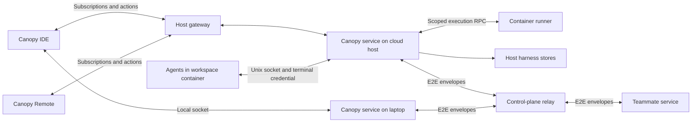

# Canopy service: the harness runs where the agents run

Status: proposal, 2026-10-09. Scope: cloud workspaces first; the laptop adopts the same service afterwards. Code review baseline: `606eb4a` (fresh `main` before extraction). This document defines the proposed implementation; it does not claim that the service exists.

## 1. Problem

The agent-facing context bridge is owned by the Tauri app. `canopy-hook --mcp` reaches it over loopback HTTP using `CANOPY_CTX_PORT` and `CANOPY_CTX_TOKEN`. Harness stores and their handlers live under `src-tauri/src`, including mesh, notes, research, companion, tasks, agent life and maintenance.

Cloud agents run in workspace containers. `packages/remote-host/agent-mcp.mjs` registers the hook, but `runner.mjs` does not inject a context endpoint or credential. Those agents have no working Canopy context service. Local mesh delivery writes to the desktop's `PtyManager`, so it cannot reach a cloud terminal.

Peer messaging currently addresses devices and enforces five-minute envelopes. `src/meshJobs.ts` keeps pending approvals and job routing state in memory. Closing the laptop removes the desktop context bridge and its ability to receive and act on traffic. Keeping cloud PTYs alive does not keep their harness alive.

## 2. Decision

A Canopy service owns harness state and answers agent tool calls where the agents run. The IDE is a client of one or more services: it subscribes to state changes and sends user actions. Closing the IDE drops a subscription; the service, stores, attention queue and cloud agents continue.

This extends the ownership boundary in [remote execution design](remote-execution-design.md) from execution to the harness.

## 3. Service boundary

### 3.1 Placement and identity

`canopy-serviced` runs on the host beside `gateway.mjs`, outside agent containers. Harness data and device private keys remain on persistent host storage and are not mounted into those containers. Each container receives a dedicated Unix socket endpoint. The host binds the endpoint to its workspace; a request cannot select another workspace through a body field.

The trusted spawn path registers a terminal with the service before launching the agent and injects a service-minted terminal credential. The credential determines the caller, workspace, session generation and permitted operations. It is revoked when the terminal exits. Reattachment after a service restart must reconcile live runner sessions without trusting identities supplied by an agent. Managed non-PTY attempts and the companion need separately scoped credentials too.

**Isolation limit:** a socket and bearer token do not establish isolation between hostile terminals that share a container UID and process namespace. The current runner uses the same container user for sessions. The initial boundary is the workspace container; per-terminal credentials prevent caller-selected identities but must not be described as proof that another terminal cannot steal a credential. Strong isolation between agents requires a separate OS isolation design before making that guarantee.

The hook needs Unix-socket transport and endpoint discovery, retaining loopback support while the laptop still embeds the core. Docker's existing container validation rejects bind mounts; socket mounting requires an explicit, narrow mount allowance and corresponding drift checks.

### 3.2 Core and adapters

Extract harness logic into a Tauri-free Rust crate, `crates/canopy-core`, consumed by both the desktop and `canopy-serviced`. Tauri command wrappers remain thin desktop adapters. The Node host retains execution and transport responsibilities; it does not duplicate harness policy or stores.

The core takes explicit dependencies:

| Boundary | Responsibility |
| --- | --- |
| `EventSink` | Publish store invalidations, attention changes and capability changes without requiring a UI subscriber. |
| `Terminals` | Discover, spawn, write, read output and close scoped sessions, with stable session generations and idempotent spawn receipts. |
| Workspace execution | Scoped filesystem reads, attachments, search, Git, external commands and language operations inside the target container. |
| Store context | Explicit storage roots, service/workspace identity, lifecycle and scheduling dependencies. |
| IDE requests | Forward UI operations to an eligible client and await a bounded, authenticated response. |

`EventSink` and `Terminals` are the first extraction interfaces, not a complete inventory. Handlers currently depend on project snapshots from the frontend, filesystem scope, task state, reminders, process execution and UI request/response routing. The service must own project/run-command configuration and tool settings so headless operation does not depend on the last IDE publication.

Container paths must never become host filesystem paths implicitly. Repository commands, language servers and browser processes execute in the workspace container through the execution adapter. Installing TypeScript or Chromium in the image does not install either on the host daemon.

### 3.3 Stores and migration

Use explicit store instances under a host-owned service data root, partitioned by workspace and any required principal scope. A shared host must not expose another workspace's notes, research, mesh or attention. Existing process-global `HOME` overrides are unsuitable for selecting concurrent workspace stores.

Keep the desktop's existing formats and paths during extraction. Only one process owns a given writable store. The final laptop daemon migration needs a controlled handoff, schema-version checks and backup/rollback handling; the app and daemon must not independently open the same legacy stores as writers.

### 3.4 Tool classification

The following table covers all 73 entries in the reviewed `SUPPORTED_TOOLS` list. Names omit the `canopy_` prefix. Add a contract check during implementation so every advertised tool has exactly one class and an implemented handler. Negotiate both tools and actions; revalidate availability when executing a request.

| Class | Tools | Without an IDE |
| --- | --- | --- |
| Service state and execution | `agents`, `claim`, `close_session`, `job_done`, `name_task`, `mesh`, `mesh_send`, `mesh_submit`, `mesh_targets`, `message_agent`, `notes`, `notes_write`, `research`, `research_write`, `recall`, `remember`, `spawn_agent`, `start_session`, `start_server`, `stop_server`, `restart_server`, `server_output`, `resources`, `wait_for`, `workspace`, `workspace_agents`, `workspace_git`, `workspace_prs`, `workspace_search`, `project`, `component_files`, `tickets`, `reviews`, `pr_details`, `pr_action` | Served when the required execution or provider capability is configured. |
| Service attention | `notify`, `ask_user`, `confirm` | Persisted attention; questions have deadlines and return `no user present` on expiry. |
| Service language | `definition`, `references`, `hover`, `symbols`, `diagnostics` | Routed to language servers in the workspace container; advertised only for implemented operations. |
| Host browser | `browser_click`, `browser_console`, `browser_eval`, `browser_navigate`, `browser_network`, `browser_point`, `browser_resize`, `browser_snapshot`, `browser_type`, `screenshot` | Phase 4; preview/browser screenshots only. Unavailable until implemented. |
| IDE only | `annotations`, `editor_state`, `open_file`, `show_diff`, `open_preview`, `open_project` | Always advertised; fail fast with `no IDE attached` when no eligible IDE is subscribed for the target workspace. |
| Laptop only | `device_describe`, `device_key`, `device_list`, `device_logcat`, `device_run`, `device_screenshot`, `device_snapshot`, `device_start`, `device_swipe`, `device_tap`, `device_type`, `vault_fill`, `vault_list`, `vault_read` | Never served by the cloud service. Vault secrets remain on the laptop. |

The advertised tool list is fixed for an agent's lifetime. `canopy-hook` declares `tools.listChanged: false` (`src-tauri/src/bin/canopy_hook.rs`), and most supported CLIs read the list once at startup, so a tool cannot appear or disappear as an IDE connects. A service advertises every tool its version implements; availability that depends on an IDE, a device or a provider is reported per call with a specific, bounded error. Laptop-only tools are not advertised by a cloud service at all.

`mesh_submit` and `mesh_targets` currently forward to the IDE. They need service handlers before headless parity can be advertised. Browser work is phase 4 in the phase list, correcting the earlier phase 3 reference.

An IDE disconnect must fail or expire an in-flight UI operation cleanly. Multiple IDE clients require explicit routing; one response wins atomically. Attention responses require authority over the target workspace, not merely possession of a stream connection. Persist request IDs, deadlines, resolution and the responding principal. A daemon restart preserves pending questions and their deadlines; clients can retry by request ID even though their old transport connection is gone. Never treat timeout as confirmation.

## 4. Mesh messaging

### 4.1 Local delivery

The host service owns the mesh store and uses the container runner to deliver into its terminals. Preserve the two-write submit: body, then `\r` after 250 ms. Serialize submissions to a target terminal so concurrent service messages cannot interleave their body and submit writes. Check the terminal generation again before the second write.

Record acceptance and delivery progress durably. A successful PTY write proves submission, not agent execution or job completion. A crash between a PTY write and its durable receipt leaves an uncertain outcome. Report it for reconciliation rather than blindly replaying a prompt that may already have executed. Do not promise exactly-once execution over a PTY.

### 4.2 The host is a mesh endpoint

Each host service registers a peer device with host-held P-256 agreement and signing keys, tagged with the workspaces it is authorized to serve. Messages and jobs target a workspace or a stable agent/session identity within it. An authenticated directory resolves that target to a host device. Person-addressed chat continues to target a person's device.

Accepted consequence: end-to-end encryption for workspace traffic terminates on the user's VM. The relay stores ciphertext and sees routing metadata. Bind workspace, recipient device, optional agent/session generation, envelope kind, creation time and expiry into the authenticated envelope. Keep the verified sender separate from any claimed identity in the plaintext.

Host replacement needs directory fencing and a policy for envelopes encrypted to the old device. A new host cannot decrypt them merely because it now serves the same workspace. Key backup/transfer or sender-visible redelivery must be decided before enabling host replacement.

### 4.3 Durable inbox and jobs

Workspace envelopes expire after seven days, matching the mesh retention window. Person-addressed chat retains its existing five-minute window. The current relay already retains envelopes until acknowledgement or expiry; this change extends workspace retention and adds durable host admission and execution state.

Change the envelope protocol and validators together. Both `src/teamMessaging/crypto.ts` and the control plane currently require exactly five minutes. Increasing a database TTL alone will not make a seven-day envelope valid. Retain compatibility for existing person-addressed traffic and reject unsupported versions explicitly.

Enforce transactional count and byte caps per recipient, alongside the existing sender count cap of 200. Define backpressure and sender-visible expiry/refusal outcomes. Persist an inbox record and its deduplication key before acknowledging relay receipt. Duplicate delivery returns the recorded outcome without rerunning the action. Keep deduplication records for at least the accepted envelope lifetime.

Persist job states such as accepted, started, done, blocked and failed, with refusal and uncertain/interrupted outcomes distinguished. Persist status updates in an outbox alongside state transitions and retry them through the durable relay. A pending approval state may support other workflows, but ungranted teammate jobs do not enter it. Recovery reconciles jobs with live runner sessions; preserving a job record does not mean its process survives container or VM termination.

### 4.4 Authority

Decision, 2026-10-09: verified envelope identity and the current workspace grant decide delivery. The current `meshJobs.ts` requires approval for every other account. Immediate delivery for granted teammates loosens that, so it is a per-workspace setting, **off by default**, that the workspace owner enables explicitly; the setting travels in the signed access snapshot. While it is off, a granted teammate's job is refused with a sender-visible reason, as for an ungranted sender.

| Sender | Delivery |
| --- | --- |
| Same account as workspace owner | Immediate, subject to valid device identity and workspace ownership. |
| Teammate with an applicable grant allowing session interaction | Immediate when the owner has enabled teammate delivery for the workspace; otherwise refused. |
| Any other teammate | Refused at the host with a sender-visible reason; no pending approval queue. |

Reuse `workspace-access.mjs`, `workspace-person-grants.mjs` and team/organization grants. Evaluate the complete applicable grant, including action, project scope and `sessions:interact`. Do not reduce the check to a `sessions` string or combine unrelated grants into broader authority.

The control plane signs access snapshots bound to workspace and recipient service. Include issuance/expiry, signing-key identity and a monotonic snapshot revision covering membership removal as well as grant changes; existing row-level `access_version` values alone do not establish that aggregate revision. Persist the latest accepted revision and reject rollback. Refresh independently of the IDE, recheck immediately before delivery and expire stale authority if refresh fails. Revocation takes effect at the next accepted snapshot; snapshot expiry bounds the disconnected case. Select refresh and expiry intervals before phase 3 implementation.

Record the verified sender and authorization decision in the mesh audit history. Successful delivery raises an attention fyi. Durable refusal/status reporting is subject to routing and membership authorization; define the sender's expiry fallback when a removed membership prevents a status reply.

## 5. IDE and service stream

One authenticated stream per service carries an initial authorized snapshot followed by ordered events. Cloud connections use the existing gateway's one-use ticket pattern; the laptop uses a local socket. Subscription and action authorization are workspace-scoped and checked separately. Revocation removes access from active streams as well as new connections.

The write-boundary change channel is the starting point, but its current notifications are coalesced invalidations, not a durable transaction log. The stream must define:

- A snapshot watermark and buffered handoff so writes racing snapshot creation are included in the snapshot or subsequent events.
- A cursor containing a service epoch and sequence, or a durable equivalent. A restart or history gap triggers a fresh snapshot.
- Sequence allocation and event insertion under the same ordering boundary. A cursor must not advance past an event that has not entered the log.
- Bounded replay and subscriber queues, with an explicit resnapshot response for slow or disconnected clients.
- Scope-wide invalidation when coalescing several changed items; the first item's ID cannot stand in for every item changed during a burst.
- Coverage for every exposed store, including research, companion and attention, and capability changes when an IDE joins or leaves.

Persisted state is authoritative; the stream can use bounded in-memory replay if restart reliably forces a snapshot. UI presence must never gate store writes or service event recording.

The IDE merges authorized streams as unions keyed by service, workspace and local object ID. Numeric PTY IDs additionally need a session generation. No service reads another service's stores. Cross-host companion, research and mesh views are projections of those separate authorities.

## 6. Phases and acceptance

1. **Extract (scoped to 2a).** Add `canopy-core`, explicit store contexts and adapter contracts for the stores and handlers phase 2a serves: mesh and claims (done in the first slice), notes, research and micro-task completion. The desktop continues to embed the core. Acceptance: the core builds and tests without Tauri; existing relevant desktop suites pass; formats, commands and behavior remain compatible. Remaining handlers move when the phase that serves them needs them, not up front.
2. **Cloud service, in two releases.**
   - **2a, headless stores.** Ship `canopy-serviced` on the host with the container socket, hook Unix-socket transport and spawn-time credentials, serving only `mesh`, `mesh_send`, `message_agent`, `claim`, `notes`, `notes_write`, `research`, `research_write` and `job_done` for agents on that host. Every other tool fails fast as unavailable. Acceptance: with the laptop closed, a cloud agent writes research and a note, messages a second cloud agent on the same host, and completes a micro-task; the reopened IDE shows the persisted results after a refetch. Verify daemon restart and concurrent workspace isolation.
   - **2b, parity and stream.** Connect execution adapters, migrate frontend-owned configuration into service ownership, implement the remaining service, attention and language classes and the resumable IDE stream. Acceptance: the remaining service-class tools work without an IDE; question deadlines, capability errors and snapshot/replay gaps behave as specified. Existing remote language analysis supports diagnostics and symbols; definition, references and hover need additional implementations.
3. **Mesh endpoint.** Add host device registration, workspace addressing, versioned envelopes, durable inbox/outbox and signed grant snapshots. Acceptance: with the owner offline, a granted teammate's message and job are delivered; an ungranted sender receives refusal; a revoked grant stops delivery after the next snapshot and expired snapshots cannot authorize delivery. Exercise duplicate envelopes, restart around acknowledgement and PTY submission, quota races and old/new protocol compatibility.
4. **Host browser.** Serve preview browser tools through the workspace image's Chromium and `chrome-stream`. Acceptance: browser operations and preview screenshots work without an IDE, remain scoped to the target workspace and fail with bounded deadlines.
5. **Laptop daemon.** Make the desktop a client of local `canopy-serviced`. Acceptance: closing the IDE leaves the local service running; reconnect restores state; migration preserves existing stores with one writer and a documented rollback path.

Service upgrades ship with the host release through `package-host-release.sh`. Hook action/tool negotiation covers advertised operations; it does not replace protocol-version negotiation, schema migrations or rollback compatibility. The daemon needs supervised startup, bounded shutdown, persistent data ownership and readiness before agent launch.

## 7. Open decisions

- **Companion:** prefer one per host so it continues while the IDE is away. Keep workspace authority explicit and scope IDE union views separately.
- **Hibernation:** a stopped VM cannot drain its inbox. Envelopes wait up to seven days. Whether an authorized job wakes a host, with what spending limits and billing notice, remains open.
- **Terminal isolation:** keep the workspace as the trust boundary initially, or add OS isolation before promising protection between hostile agents in the same workspace.
- **Access snapshots (decided 2026-10-09):** snapshots expire 15 minutes after issue and the host refreshes every 5 minutes, so a refresh can fail twice before authority lapses to owner-only. The aggregate revision is `workspace.access_revision`, owned by database triggers (grants, team and organization membership, team moves, ownership, organization moves, deletion, `team_delivery`), so no mutation path can forget it. Signing is Ed25519 from `CANOPY_ACCESS_SIGNING_KEY` with `CANOPY_ACCESS_SIGNING_KID`; rotation publishes the new kid to hosts' verify-key map before switching the signer, then retires the old kid after one expiry window (15 minutes).
- **Host replacement:** decide how keys and pending encrypted envelopes survive replacement or migration.
- **Teammate delivery default:** confirm off-by-default with explicit owner opt-in, and whether the opt-in is per workspace or per granted teammate.
- **Delivery recovery:** specify how users reconcile uncertain PTY submission and how typed job protocols may later provide stronger execution receipts.

## 8. Review against the current code

| Finding | Evidence | Design consequence |
| --- | --- | --- |
| Cloud agents lack the context endpoint. | [`runner.mjs`](../packages/remote-host/runner.mjs) spawn environment; [`agent-mcp.mjs`](../packages/remote-host/agent-mcp.mjs) registration; [`canopy_hook.rs`](../src-tauri/src/bin/canopy_hook.rs) endpoint discovery. | Add transport, spawn-time registration and credential lifecycle together. |
| Mesh and notes cannot move as-is. | [`mesh.rs`](../src-tauri/src/mesh.rs) references `context::Claim`, `pty::instance_token` and `change::pulse`; [`notes.rs`](../src-tauri/src/notes.rs) has Tauri commands, `State`, filesystem scope and reminder calls. | Extract shared models and store dependencies; leave command wrappers in Tauri. AppHandle counts understate coupling. |
| Two traits do not cover all handler dependencies. | [`context.rs`](../src-tauri/src/context.rs) uses frontend snapshots, task/research/notes stores, filesystem and process helpers in addition to PTYs and events. | Inventory dependencies by operation before moving handlers. |
| A host socket requires Docker validation changes. | [`docker.mjs`](../packages/remote-host/docker.mjs) requires user `1000:1000`, private namespaces and volume-only mounts. | Permit only the designated service socket mount; do not relax general mount validation. |
| Five-minute expiry is cryptographically bound and validated at both ends. | [`crypto.ts`](../src/teamMessaging/crypto.ts) and [`peer-messaging.mjs`](../packages/control-plane/lib/peer-messaging.mjs). | Version the protocol; retain person-chat compatibility. The relay already has explicit polling and acknowledgement. |
| The change feed is not yet a resumable service stream. | [`change.rs`](../src-tauri/src/change.rs) returns early without an AppHandle, keeps 1,024 in-memory entries and allocates sequence numbers before locking history. Research separately emits in [`research.rs`](../src-tauri/src/research.rs). | Add subscriber-independent recording, ordering, gap detection and full store coverage. |
| Existing grants have more conditions than session permission alone. | [`workspace-access.mjs`](../packages/control-plane/lib/workspace-access.mjs) checks roles, project scopes and membership-derived grants independently. | Preserve complete grant evaluation in signed snapshots. |
| Installed language tooling does not establish full tool parity. | [`language.mjs`](../packages/remote-host/language.mjs) runs bounded diagnostics and document-symbol analysis inside the container; [`Dockerfile`](../packages/remote-host/Dockerfile) installs TypeScript and Chromium. | Implement remaining language operations and route execution into the container. |
| Job routing currently depends on the IDE and memory. | [`meshJobs.ts`](../src/meshJobs.ts) allows the same account to bypass approval, requires approval for teammates and keeps outgoing jobs, runs and pending approvals in memory. | Move lifecycle state into the service and explicitly change teammate admission to the complete workspace-grant rule. |

The reviewed `context.rs` is 6,664 lines. Dependency boundaries and behavior, rather than textual AppHandle counts, determine extraction scope. The initial review on `5912438` predated the mesh job integration; the fresh-main review above includes it.

## 9. First extraction PR

The first implementation slice introduces `crates/canopy-core` and makes the desktop consume its mesh message store, SQLite claim store, claim/refusal models, store event contract and two-write terminal delivery. Store constructors take explicit paths, event sinks and runtime identity. The desktop adapter preserves `CANOPY_MESH_HOME`, `~/.canopy/mesh`, existing on-disk formats and frontend payloads. Both writes validate the terminal's runtime instance and child generation.

The `EventSink` contract currently covers store invalidations. `Terminals` currently covers target resolution and input writes. Further extraction will extend these contracts as actual callers move. The existing desktop debounce/replay implementation remains in Tauri; this slice does not claim the service stream guarantees in section 5.

This begins phase 1. Notes, research, tasks, companion, the rest of the context handlers and lifecycle work remain to be extracted. The daemon, cloud socket transport and durable peer routing remain later phases. Message persistence retains its existing best-effort behavior; durable inbox acknowledgement must not use that behavior as proof of a committed record.

Local validation includes the standalone core suite, store/claim frontend guards, and a desktop integration test that sends through the core into a real PTY. The core suite checks isolated store paths and subscribers, restart persistence, legacy formats, claim recovery, delayed submission and terminal replacement. CI runs the core suite without installing Tauri or webview dependencies. `src-tauri` is the Cargo workspace root and `canopy-core` a member, so both share one `Cargo.lock`, one target directory and one declared `rust-version` (1.82, which the desktop already required through `Option::is_none_or`). Core's `Store` enum lists only stores core owns; the desktop maps each onto its own channel, and coalescing stays in `change.rs`.
