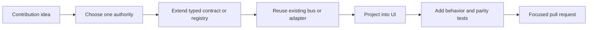

# Contribution Playbooks

Each page describes one supported contribution path from idea to pull request.
Start with the narrowest playbook that matches the change. For system context,
read [Canopy Architecture](../architecture.md). For bus selection and shared
integration rules, read the
[Contributor Integration Guide](../contributor-integrations.md).
For branch, review, test disclosure, and merge expectations, read
[Pull Request Etiquette](../pull-request-etiquette.md).

## Playbook index

| Contribution | Playbook | Main extension seam |
|---|---|---|
| Theme or skin | [Theme](./theme.md) | `src/skins/registry.ts` |
| Shared or application component | [Component](./component.md) | `shared/` or `src/components/` |
| Desktop feature | [Desktop feature](./desktop-feature.md) | Domain module plus existing project composition |
| Project tab or side panel | [Project surface](./project-surface.md) | `SubTab` / `SideTab` and `ProjectView` |
| Native capability | [Native capability](./native-capability.md) | Rust owner plus Tauri IPC |
| Agent-visible tool | [Agent tool](./agent-tool.md) | Context bridge and `canopy-hook` MCP |
| SpotSearch source | [Search source](./search-source.md) | `registerSpotSource` |
| Issue tracker | [Tracker](./tracker.md) | `TrackerProvider` |
| Coding-agent CLI | [Agent CLI](./agent-cli.md) | CLI registry and integration healing |
| Automated micro-task | [Micro-task](./micro-task.md) | `MicroTaskDef` |
| Durable Canopy data | [Durable store](./durable-store.md) | Rust store and invalidation bus |
| Canopy Remote feature | [Remote feature](./remote-feature.md) | Manifest, Rust grant, generic RPC, panel |
| File renderer | [File viewer](./file-viewer.md) | `ViewerKind` and byte renderer |
| Keyboard shortcut | [Shortcut](./shortcut.md) | `shared/shortcuts.json` |
| Team collaboration message | [Relay message](./relay-message.md) | Encrypted relay and `RelayHandle` |

## Shared lifecycle

Every contribution should follow the same ownership path.

## Pull request questions

Answer these for any contribution that crosses a boundary:

1. Which module owns the new state or resource?
2. Which existing registry, adapter, or bus carries it?
3. What bounds memory, payload size, retries, and lifetime?
4. What cleanup runs when its owner closes?
5. Which test proves every side of the integration agrees?
6. Which duplicate implementation did the contribution avoid?
