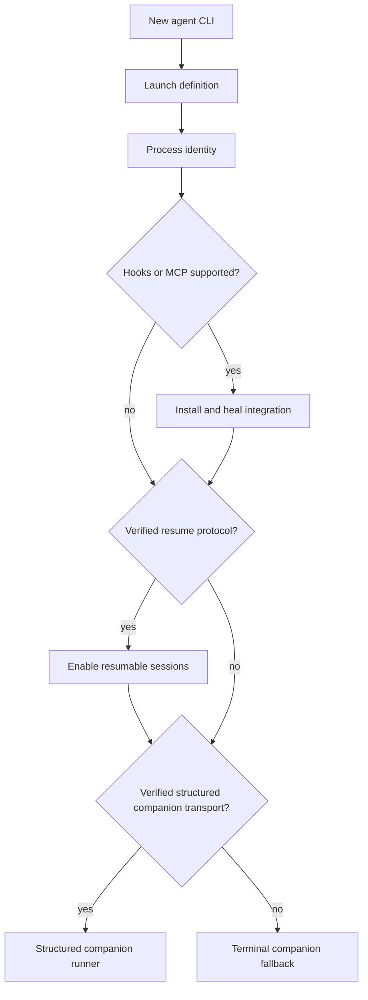
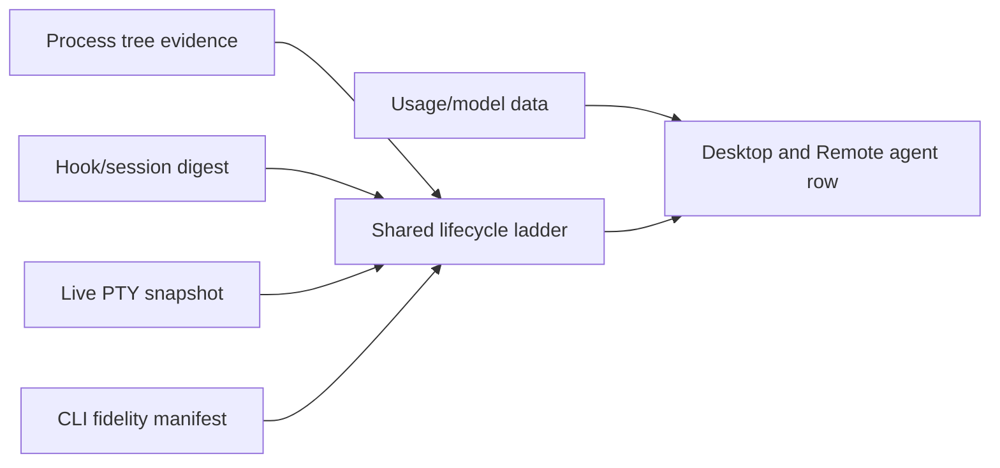

# Contributing a Coding-Agent CLI

Use this playbook to add a coding CLI to Canopy's launcher, lifecycle detection,
session restoration, hook integration, or app-wide companion support.

## Integration levels



Support can land in stages. Do not claim lifecycle, resume, hook, or companion
capabilities that have not been verified against the real CLI.

## Files

```text
src/projects.ts                         CLI registry, launch/resume templates
src/agentModels.ts                      model metadata when applicable
shared/agentLife/fidelity.json          lifecycle evidence capability
src-tauri/src/agentid.rs                process/package identity
src-tauri/src/agents.rs                 hook/MCP install and healing
src-tauri/src/bin/canopy_hook.rs        hook protocol and MCP server
src/companion.ts                        verified companion runner or fallback
docs/agent-parity.md                    capability audit
```

## Steps

1. Verify installation paths, executable name, launch syntax, prompt syntax,
   resume syntax, hook support, MCP support, session store, and model listing.
2. Record the evidence in the agent parity documentation.
3. Add a stable CLI ID and browser-safe display metadata.
4. Add launch command construction without shell-specific assumptions.
5. Add resume only if a stable session token and verified command exist.
6. Extend process identity through executable, package, script, or wrapper
   evidence rather than tab labels.
7. Declare only the lifecycle evidence the CLI can actually emit.
8. Add hook/MCP configuration install and launch-time healing when supported.
9. Refuse to overwrite foreign MCP registrations.
10. Add model and usage adapters only when source data is reliable.
11. Add a structured companion runner only for a verified protocol; otherwise
    retain the PTY fallback.
12. Test launch, identity, profile/account behavior, resume, stale sessions,
    integration healing, and unsupported degradation.

## Session evidence flow



Historical store rows without lifecycle evidence are `unknown`, never invented
as `idle`.

## Verification

```sh
npm run test -- src/agentIdentity.test.ts src/agentSessions.test.ts shared/agentLife/parity.test.ts
cargo test --manifest-path src-tauri/Cargo.toml --no-default-features agentid::tests
npm run typecheck
```

## Pull request checklist

- [ ] Real CLI behavior was researched and recorded.
- [ ] Stable ID and command construction added.
- [ ] Resume is verified or deliberately absent.
- [ ] Identity does not rely on a tab title.
- [ ] Fidelity manifest claims only real signals.
- [ ] Hook/MCP integration heals safely.
- [ ] Foreign configuration is preserved.
- [ ] Companion uses structured transport only when verified.
- [ ] Unsupported features degrade honestly.
