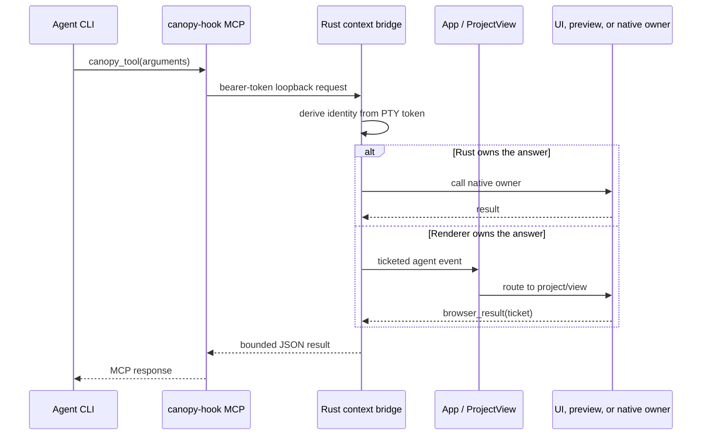
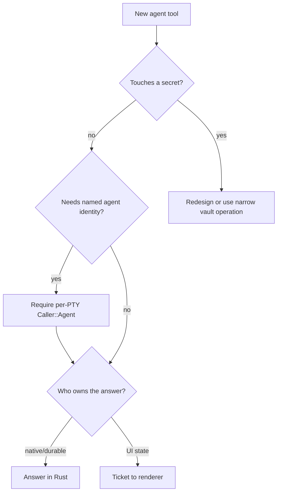

# Contributing an Agent Tool

Use this playbook when an agent running inside Canopy needs IDE context or an
operation it cannot obtain safely through ordinary file and shell tools.

## Trust and request flow



Agents do not receive the trusted Tauri command surface. Their context token is
the caller identity; never trust a PTY ID, owner, or cwd supplied in the body.

## Files

```text
src-tauri/src/bin/canopy_hook.rs  MCP descriptor, schema, dispatch
src-tauri/src/context.rs          authenticated endpoint and policy
src/ipc.ts                        typed event/request shape for UI work
src/agentOps.ts                   UI-only operation dispatch, when applicable
src/agentTools.ts                 human-facing tool row and disable setting
src/App.tsx                       app/project routing only, when applicable
```

## Steps

1. Confirm the agent cannot safely answer the question using its normal tools.
2. Choose a stable `canopy_*` name and a narrow argument schema.
3. Decide whether Rust owns the answer or the renderer must answer it.
4. Add the model-facing MCP descriptor and dispatch in `canopy_hook.rs`.
5. Add or reuse a token-gated endpoint in `context.rs`.
6. Require `Caller::Agent` for identity-sensitive work. Allow `Caller::Root`
   only when the app-wide companion may perform the operation anonymously.
7. For UI work, use the existing pending ticket and result path.
8. Route through `App` and `ProjectView` only as far as needed to locate the
   owning view.
9. Add the same tool name to `src/agentTools.ts` with concise human copy.
10. Bound response size and add timeout/error completion.
11. Redact secrets and return paths instead of file bodies where possible.
12. Test authentication, schema errors, disabled tools, timeouts, and success.

## Tool authority decision



## Verification

```sh
cargo test --manifest-path src-tauri/Cargo.toml --no-default-features context::tests
npm run test -- src/agentTools.test.ts src/agentOps.test.ts
npm run typecheck
```

Use the actual nearby test names if the tool belongs to a more specific module.

## Pull request checklist

- [ ] Normal agent tools cannot already solve the need.
- [ ] Stable name and narrow schema defined.
- [ ] Identity derives from the credential.
- [ ] Root companion authority decided explicitly.
- [ ] Rust or renderer owner selected correctly.
- [ ] Human-facing and model-facing tool rosters agree.
- [ ] Response, timeout, errors, and secrets are bounded.
- [ ] Authentication and routing tests added.
