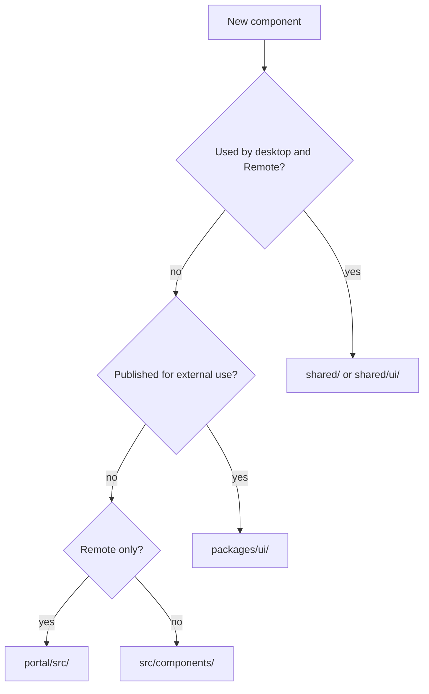
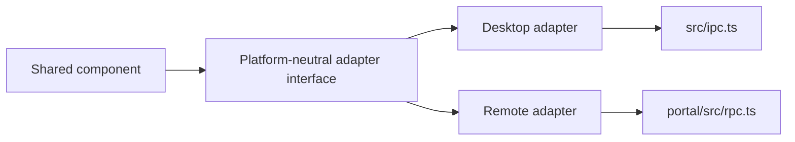

# Contributing a Component

Use this playbook for a reusable primitive, a cross-shell component, or a
feature component inside one application.

## Choose its home



`shared/` is the active cross-shell layer. `packages/ui/` is independently
publishable and is not automatically consumed by the applications.

## Reuse before creating

| Need | Existing component |
|---|---|
| Button | `shared/ui/Button.tsx` |
| Dialog, confirmation, prompt | `shared/Dialog.tsx` |
| Context menu | `shared/ContextMenu.tsx` |
| Large list | `shared/WindowedList.tsx` |
| File tree | `shared/FileTree.tsx` |
| Escape ownership | `shared/useEscape.ts` |
| Icons | `shared/icons.tsx`, `src/components/icons.tsx` |

## Cross-shell adapter flow



## Steps

1. Confirm no existing component already owns the behavior.
2. Put pure state transitions and calculations in a framework-free module.
3. Define typed props and callbacks. Prefer controlled state where the parent is
   the real owner.
4. For cross-shell components, define a minimal adapter interface. Make mutation
   methods optional when Remote must remain read-only.
5. Use semantic CSS variables and place shared CSS beside the shared component.
6. Reuse shared overlay, dialog, escape, icon, and button behavior.
7. Add keyboard interaction, accessible names, focus behavior, and cleanup.
8. Add a colocated behavior test.
9. If cross-shell, render through desktop and Remote adapters and run structural
   guards.

## Lifecycle rules

- Hide stateful terminal, editor, and preview panes instead of unmounting them.
- Unsubscribe listeners and dispose models, timers, object URLs, and observers.
- Keep expensive parsing, sanitization, and model creation out of render.
- Do not dispatch a global event when a typed callback can reach the owner.

## Verification

```sh
npm run test -- path/to/Component.test.tsx
npm run test -- shared/sharedComponents.test.ts
npm run typecheck
```

## Pull request checklist

- [ ] Correct desktop/shared/Remote/package home selected.
- [ ] Existing primitive reused where possible.
- [ ] Platform work injected through an adapter.
- [ ] Styling uses semantic tokens.
- [ ] Keyboard, focus, accessibility, and cleanup covered.
- [ ] Behavior test added.
- [ ] No desktop implementation was duplicated in Remote.
