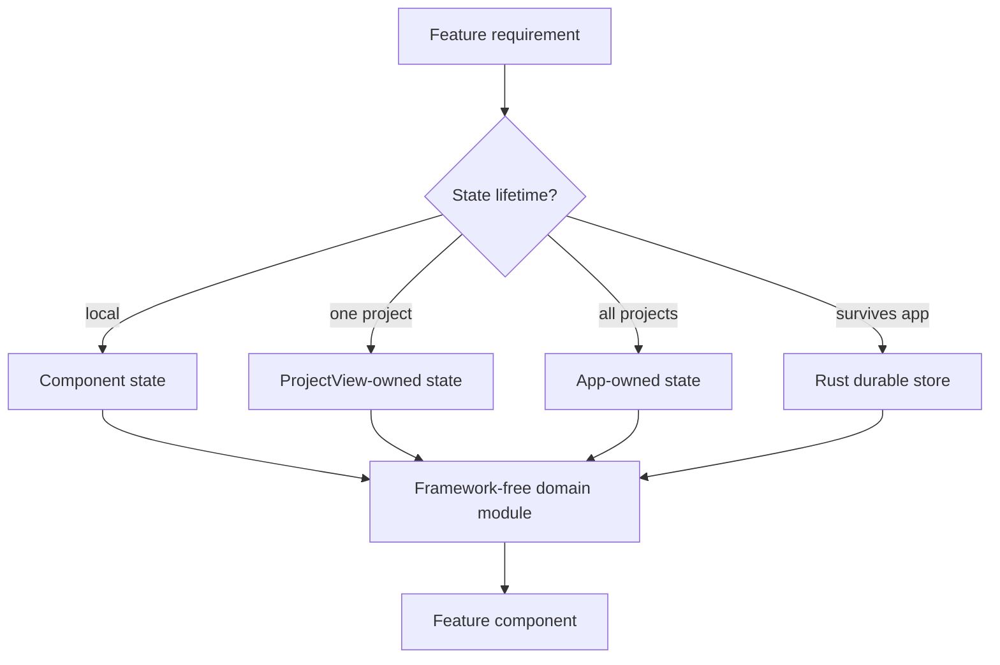
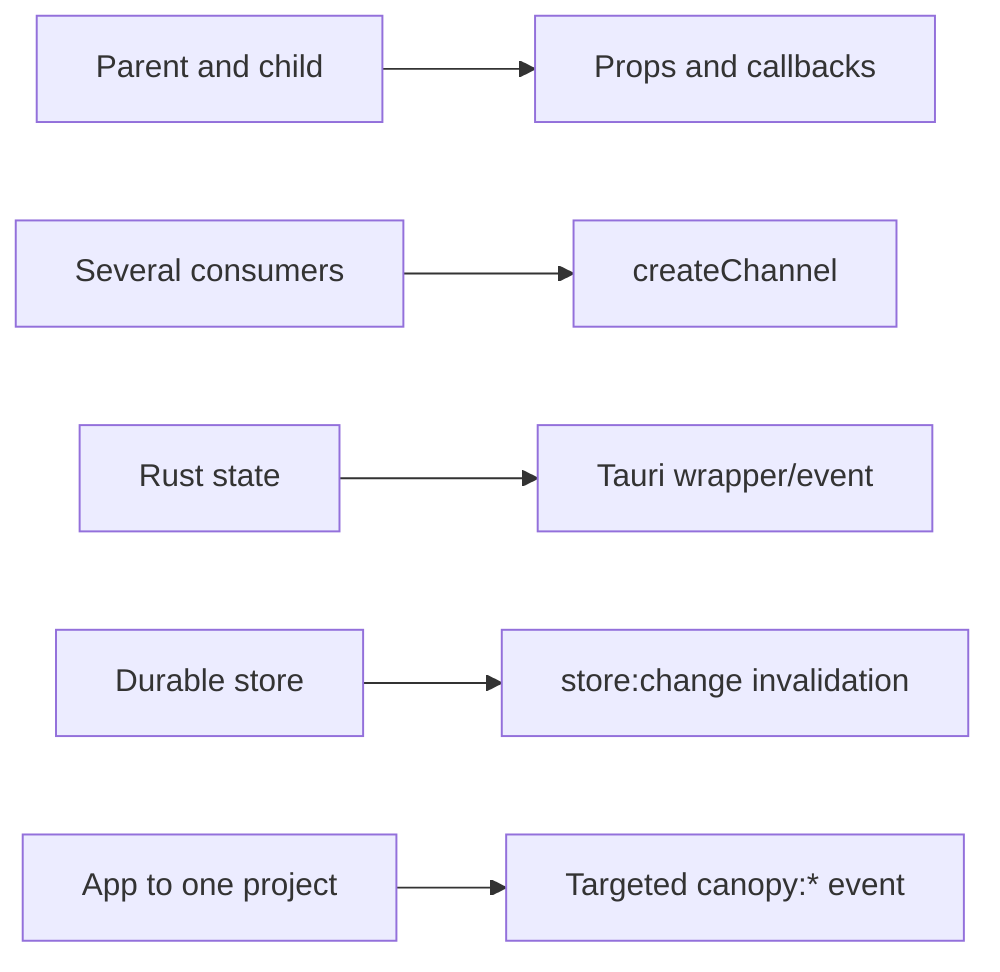

# Contributing a Desktop Feature

Use this playbook for a desktop workflow that primarily composes existing data
and capabilities. If it requires a new native operation, also follow
[Native Capability](./native-capability.md). If it needs a new project tab or
panel, also follow [Project Surface](./project-surface.md).

## Ownership flow



## Files

Typical desktop feature:

```text
src/<feature>.ts                     pure rules and state projection
src/<feature>.test.ts                behavior tests
src/components/<Feature>.tsx         presentation
src/components/<Feature>.test.tsx    interaction tests, when needed
src/components/ProjectView/index.tsx composition only, when project-scoped
src/App.tsx                           composition only, when app-scoped
```

## Steps

1. Write the user-visible behavior as a failing test.
2. Identify the real state owner: component, project, app, or Rust store.
3. Search for an existing module, store, channel, tab, and event path before
   creating one.
4. Put reusable rules in `src/<feature>.ts`, not in `App.tsx` or the large
   `ProjectView` component.
5. Build the component from shared buttons, dialogs, menus, icons, and tokens.
6. Wire it into the owning composition root with the smallest possible change.
7. Add a shortcut, SpotSearch row, deep link, or notification only if the user
   needs that entry path.
8. Preserve mounted state for long-lived surfaces.
9. Test cleanup, empty states, errors, and focus behavior.

## Bus selection



Use the narrowest bus. A desktop feature should not introduce a global event by
default.

## Verification

```sh
npm run test -- src/<feature>.test.ts
npm run typecheck
npm run lint
```

## Pull request checklist

- [ ] State owner identified.
- [ ] Pure behavior extracted and tested.
- [ ] Existing store, channel, or registry reused.
- [ ] Composition roots contain wiring, not feature policy.
- [ ] Shared components and semantic tokens used.
- [ ] Long-lived surface and cleanup behavior preserved.
- [ ] Optional entry points are justified.
