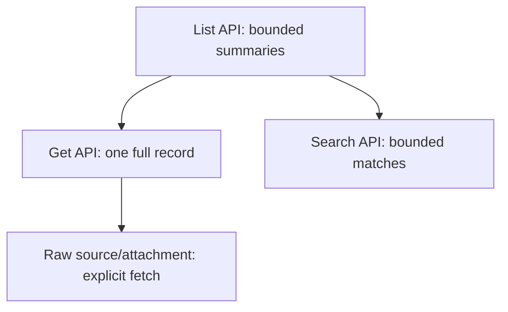

# Contributing a Durable Store

Use this playbook when Canopy-owned project knowledge or workflow state must
survive app restarts and may be written by the WebView, agents, or Remote.

## Authority and invalidation flow


The store write is the announcement point. A caller-side event misses writes
from every other caller.

## Files

```text
src-tauri/src/<store>.rs    schemas, validation, mutations, atomic persistence
src-tauri/src/change.rs     Store variant and invalidation pulse
src-tauri/src/lib.rs        managed state and command registration
src/<store>.ts              cache, refresh, mutation wrappers, UI event/channel
src/stores.ts               one store-change router
src/components/<Store>*.tsx list/detail presentation
src-tauri/src/spot.rs       optional derived indexing
```

Use `notes.rs` and `research.rs` as references.

## Steps

1. Decide whether the data belongs to Canopy or to the user's repository.
2. Choose a project-scoped layout under `~/.canopy/<store>/` for Canopy-owned
   data.
3. Define stable IDs, bounded list summaries, and separately fetched details.
4. Reject empty, dotted, path-like, or traversal-containing IDs.
5. Canonicalize attachment/source paths and verify containment.
6. Serialize mutations with managed state.
7. Write temporary files and atomically rename them.
8. Cap body, source, attachment, list, and search sizes.
9. Add Tauri commands and register them in `lib.rs`.
10. Add a `change::Store` variant and pulse after successful mutations.
11. Register one module-scope frontend handler with `registerStore`.
12. Refetch authoritative data after invalidation.
13. Add indexing only as a rebuildable derivative.
14. Test path attacks, partial writes, concurrent mutations, limits, and every
    status transition.

## Read model



Do not return every full body or raw attachment in list calls.

## Verification

```sh
cargo test --manifest-path src-tauri/Cargo.toml --no-default-features <store>::tests
npm run test -- src/<store>.test.ts src/storeChangeGuard.test.ts
npm run typecheck
```

## Pull request checklist

- [ ] Data location and ownership justified.
- [ ] IDs and derived paths are contained.
- [ ] Mutations are serialized and atomic.
- [ ] Payloads and item counts are capped.
- [ ] List/detail/raw tiers are separate.
- [ ] Rust write boundary pulses the change bus.
- [ ] Frontend cache refetches on invalidation.
- [ ] Index is derivative, not authoritative.
- [ ] Failure and traversal tests added.
