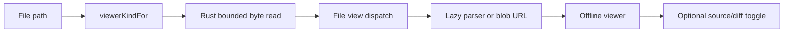
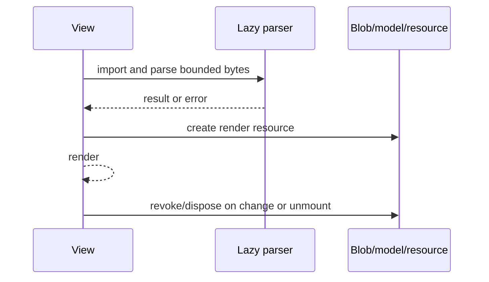

# Contributing a File Viewer

Use this playbook to render another file type natively and offline when a file
opens in Canopy.

## Viewer flow



Viewers receive bytes from the scoped Rust filesystem boundary. They do not read
arbitrary paths or fetch a hosted renderer.

## Files

```text
src/components/viewers.tsx      ViewerKind, extension mapping, viewer component
src/fileOpen.ts                 size/binary refusal policy
src/components/FileView.tsx     render dispatch and source toggle
src/types.ts                    open-file metadata when needed
```

Use nearby viewer tests or add `viewers.test.tsx` for the new behavior.

## Steps

1. Add a stable `ViewerKind` member.
2. Map only the supported extensions in `viewerKindFor`.
3. Decide whether a text source view is meaningful.
4. Define maximum safe input and binary behavior before parsing.
5. Implement a component that accepts the already-read bytes and path metadata.
6. Lazy-load a heavy parser so unrelated file opens do not pay its cost.
7. Sanitize generated HTML before rendering it.
8. For blob URLs, copy bytes when needed and revoke URLs on cleanup.
9. Cancel or ignore async parser completion after unmount.
10. Add render dispatch and source/diff toggle behavior.
11. Handle empty, corrupt, oversized, unsupported, and parser-error states.
12. Test extension mapping, successful render, refusal, cleanup, and fallback.

## Parser lifecycle



## Verification

```sh
npm run test -- src/fileOpen.test.ts
npm run typecheck
npm run build
```

Add and run a focused viewer component test for the new renderer; there is no
generic `viewers.test.tsx` file today.

## Pull request checklist

- [ ] Viewer kind and extensions are narrow and explicit.
- [ ] Read/size policy is defined before parsing.
- [ ] Heavy dependency is lazy-loaded.
- [ ] Generated HTML is sanitized.
- [ ] Blob/model/parser resources are disposed.
- [ ] Source and fallback behavior are defined.
- [ ] Empty, corrupt, oversized, and unsupported cases tested.
- [ ] Viewer works offline.
