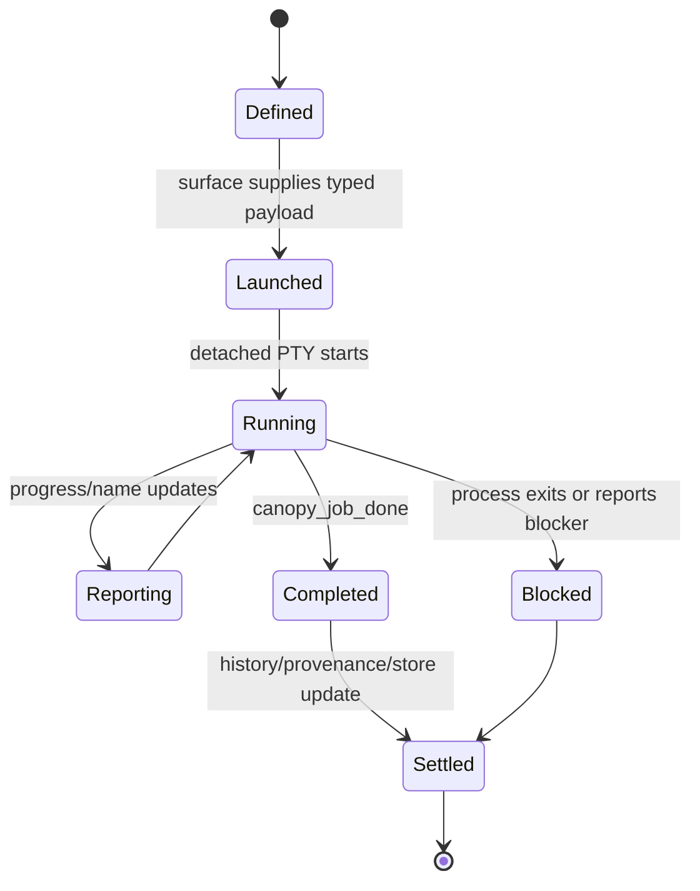
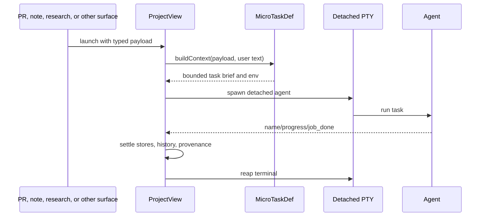

# Contributing an Automated Micro-task

Use this playbook for a focused agent job launched from a known Canopy surface,
such as reviewing a PR, fixing CI, implementing research, or working on a note.

## Task lifecycle



## Files

```text
src/microTasks.ts                       task definition and registry
src/components/ProjectView/index.tsx    surface launch and settlement wiring
src/microRuns.ts                        run projection
src/taskHistory.ts                      completed task history
src-tauri/src/pty.rs                    detached PTY owner
```

## Steps

1. Choose a job whose scope and completion condition are known before launch.
2. Define a typed payload from the source surface.
3. Add a `MicroTaskDef` with stable ID, label, icon, placeholder, effect,
   source-surface note, cwd, environment, and context builder.
4. Make the brief state authority limits: whether the agent may edit, branch,
   commit, push, or only research.
5. Add progress steps only when they are real, ordered milestones the task can
   report. Omit invented steps for open-ended work.
6. Register the task in `MICRO_TASKS`.
7. Wire the source CTA to supply the payload.
8. Preserve `canopy_name_task` and `canopy_job_done` for micro-task terminals.
9. Define success, blocked, unexpected exit, project close, and cleanup paths.
10. Settle task history, provenance, linked notes/research, and PTY state once.
11. Test the generated brief and settlement behavior.

## Launch flow



## Verification

```sh
npm run test -- src/microTasks.test.ts src/microRuns.test.ts src/taskHistory.test.ts
npm run typecheck
```

## Pull request checklist

- [ ] Task has a focused, knowable completion condition.
- [ ] Payload and source surface are typed.
- [ ] Brief states edit/Git authority explicitly.
- [ ] Progress steps are real or omitted.
- [ ] Completion and blocked paths call the existing settlement flow.
- [ ] Project close and process exit clean up detached PTYs.
- [ ] Generated brief and settlement behavior tested.
