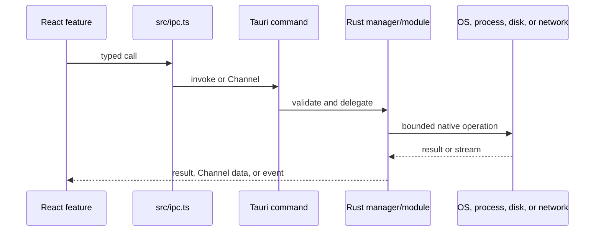

# Contributing a Native Capability

Use this playbook for filesystem, process, operating-system, network, Git, LSP,
browser, or other privileged work. Rust owns the resource; the WebView receives
a typed projection. Read [Core Rust System](../core-rust-system.md) for the full
module, managed-state, concurrency, persistence, and security map.

## Boundary flow



## Files

```text
src-tauri/src/<owner>.rs   resource owner and command implementation
src-tauri/src/lib.rs       managed state and command registration
src/ipc.ts                 typed frontend wrapper
src/<caller>.ts(x)         feature use
```

Also inspect `fsx.rs` for path scope, `blocking.rs` for synchronous system work,
and the `lib.rs` exit handler for cleanup patterns.

## Choose the IPC shape

| Operation | Shape |
|---|---|
| One bounded request and result | Tauri `invoke` |
| Ordered/high-volume stream opened by a request | Tauri `Channel` |
| Independent lifecycle or invalidation | Tauri event with one frontend listener |

## Steps

1. Write Rust tests for validation and failure behavior.
2. Put ownership in the domain module or a managed service, not in the command
   function itself.
3. Validate and canonicalize path, URL, identifier, and size inputs.
4. Route ordinary paths through `WorkspaceManager`.
5. Move synchronous system work through the existing blocking boundary.
6. Bound queues, output, request bodies, retained history, and timeouts.
7. Define cancellation and teardown before exposing the command.
8. Register managed state with `.manage(...)` when required.
9. Register the command in `tauri::generate_handler!`.
10. Add one typed `src/ipc.ts` wrapper.
11. Use a result for a caller-owned request, a `Channel` for a stream, or an
    event for independent lifecycle state.
12. Add frontend behavior tests with mocked commands.
13. Keep the capability unavailable to Remote unless separately designed and
    granted.

## Cleanup flow


## Verification

```sh
cargo test --manifest-path src-tauri/Cargo.toml --no-default-features <module>::tests
npm run test -- src/<caller>.test.ts
npm run typecheck
```

## Pull request checklist

- [ ] One Rust owner exists.
- [ ] Inputs are scoped and bounded.
- [ ] Blocking/async boundary is correct.
- [ ] Cancellation, timeout, and app-exit cleanup exist.
- [ ] Command is registered and wrapped once.
- [ ] Events are invalidations or lifecycle signals, not hidden RPC.
- [ ] Remote remains denied unless explicitly reviewed.
- [ ] Rust and frontend tests cover failure behavior.
