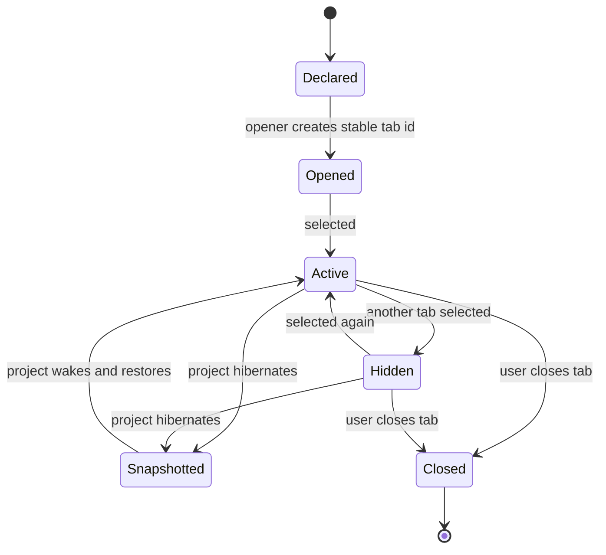
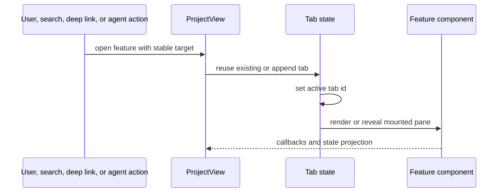

# Contributing a Project Tab or Side Panel

Use this playbook when a feature needs project-level navigation, a tab identity,
or a side-panel destination. Do not create a new surface for a feature that can
fit naturally inside an existing view.

## Surface lifecycle



Stateful panes generally stay mounted while hidden. Hibernation and close are
explicit lifecycle transitions.

## Files to inspect

```text
src/components/ProjectView/helpers.ts  SubTab / SideTab and metadata
src/components/ProjectView/index.tsx   state, opener, selection, rendering, close
src/tabKind.ts                         tab classification
src/tabGroups.ts                       grouping, if relevant
src/deepLinks.ts                       direct navigation, if relevant
src/spotSources.ts                     discoverability, if relevant
src/hibernation.ts                     snapshot/restore, if persistent
```

## Steps

1. Decide whether this is a document tab, terminal-like surface, agent surface,
   or side panel.
2. Add one discriminated-union member with a stable identity.
3. Search for every exhaustive switch over that union.
4. Add the opener and deduplication behavior.
5. Add render dispatch using a focused component.
6. Define close behavior and resource cleanup.
7. Decide whether inactive instances stay mounted. Default to preserving state.
8. Add hibernation snapshot/restore only for state that cannot be rebuilt.
9. Add deep-link, SpotSearch, and tab-group behavior when relevant.
10. Test open, deduplicate, switch, hide, restore, and close behavior.

## Opening flow



## Verification

Run the focused domain and component tests plus relevant tab tests:

```sh
npm run test -- src/tabKind.test.ts src/tabGroups.test.ts
npm run typecheck
```

## Pull request checklist

- [ ] Existing surface could not reasonably host the feature.
- [ ] Stable tab identity and deduplication defined.
- [ ] Every union switch updated.
- [ ] Hide, close, and hibernation semantics defined.
- [ ] Resource cleanup defined.
- [ ] Deep-link/search/group integration added only where useful.
- [ ] Lifecycle behavior tested.
