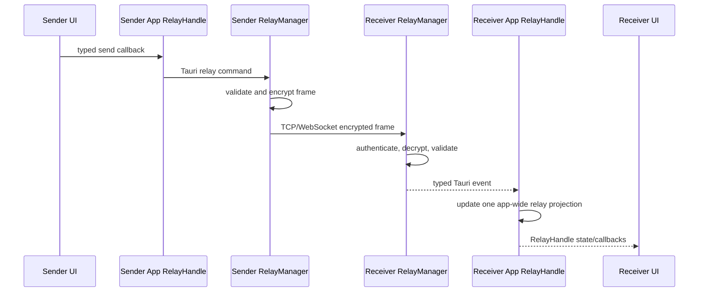
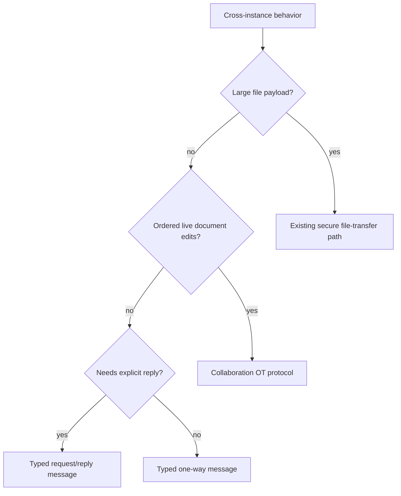

# Contributing a Team Relay Message

Use this playbook when two Canopy instances need a new peer-to-peer message,
request, or transfer behavior. Do not use the relay for local component events,
agent context calls, or Remote browser RPC.

## Peer flow



## Files

```text
src-tauri/src/relay.rs      wire type, validation, crypto, transport handling
src-tauri/src/wsbridge.rs   async WebSocket bridge when relevant
src/ipc.ts                  typed command/event projection
src/types.ts                app-wide RelayHandle projection
src/App.tsx                 one relay state owner and event subscription
src/components/<feature>    sender/receiver presentation
```

For collaborative editor operations, use `src/collab.ts` and
`src/collab-ot.ts`; do not encode editor mutations as chat.

## Steps

1. Confirm the behavior crosses two Canopy instances.
2. Define a version-tolerant, bounded wire payload.
3. Add strict deserialization and validation in `relay.rs`.
4. Preserve authenticated encryption, monotonic nonces, frame-size caps, and
   peer identity checks.
5. Choose broadcast, direct peer, request/reply, or transfer semantics.
6. Add replay, deduplication, timeout, or acknowledgement where the operation
   needs it.
7. Add a typed Tauri command and receive event wrapper.
8. Let `App` update the existing app-wide `RelayHandle`.
9. Pass state and callbacks to views; never open another relay connection.
10. Route notifications through the existing attention/deep-link path.
11. Test malformed frames, oversized payloads, disconnect, retry, duplicate,
    wrong peer, and successful delivery.

## Primitive decision



## Verification

```sh
cargo test --manifest-path src-tauri/Cargo.toml --no-default-features relay::tests
npm run test -- src/collab-ot.test.ts
npm run typecheck
```

Run the feature's focused UI tests as well.

## Pull request checklist

- [ ] Relay is the correct cross-instance boundary.
- [ ] Payload is typed, validated, and bounded.
- [ ] Encryption and identity invariants are preserved.
- [ ] Delivery/reply/retry semantics are explicit.
- [ ] Existing app-wide connection and `RelayHandle` are reused.
- [ ] File transfer or OT protocol reused when applicable.
- [ ] Disconnect, duplicate, malformed, and oversized cases tested.
