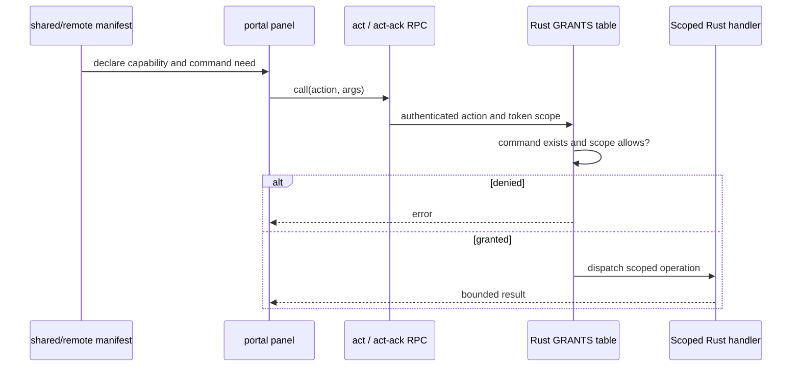
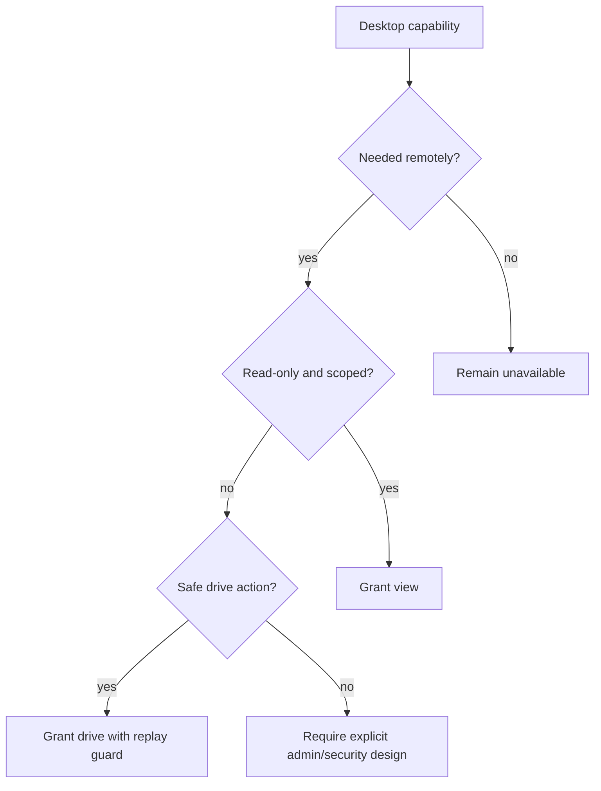

# Contributing a Canopy Remote Feature

Use this playbook to expose an existing Canopy capability to the embedded Remote
browser application. Remote is a separate, restricted trust boundary; desktop
availability never implies Remote availability.

## Authorization and rendering flow



TypeScript requests authority. Rust grants it.

## Files

```text
shared/remote/modules/<feature>.ts     capability manifest
shared/remote/modules/index.ts         manifest registration
src-tauri/src/remote/mod.rs            grant and command dispatch
src-tauri/src/remote/streams.rs        stream provider, if needed
src-tauri/src/remote/verbs.rs          renderer-owned verb, if needed
portal/src/panels/<feature>.tsx         Remote presentation
portal/src/panels/index.ts              panel registration
shared/remote/registry.test.ts          manifest/grant/stream parity
portal/src/remote.test.ts               panel parity
```

## Choose a primitive

| Need | Primitive |
|---|---|
| Read or bounded native action | Existing generic command RPC |
| Continuous live data | Registered stream provider |
| Action only desktop renderer can perform | Registered verb with reply |
| Static feature availability | Manifest capability |

## Steps

1. Confirm the capability should be available away from the trusted WebView.
2. Choose the least scope: `view`, `drive`, or `admin`.
3. Declare the feature and its command/stream needs in a pure shared manifest.
4. Register the manifest.
5. Add a deliberate Rust grant. Read each grant as a security review.
6. Reuse workspace scope for every path-taking operation.
7. Add replay or single-flight protection for retry-sensitive mutations.
8. Add a stream only for continuous data; do not poll high-frequency state.
9. Add a renderer verb only when Rust genuinely does not own the required
   state.
10. Build the panel against generic RPC and shared models.
11. Register the panel for compact and wide shells as appropriate.
12. Test insufficient scope, missing grant, reconnect, retry, path refusal,
    empty state, and panel parity.

## Security decision



Repository writes, Git ref movement, push/merge, and vault access are currently
deliberately excluded.

## Verification

```sh
npm run test -- shared/remote/registry.test.ts portal/src/remote.test.ts
cargo test --manifest-path src-tauri/Cargo.toml --no-default-features remote::
npm run typecheck
```

## Pull request checklist

- [ ] Remote exposure is justified separately from desktop availability.
- [ ] Least scope selected.
- [ ] Manifest request and Rust grant agree.
- [ ] Paths use workspace scope.
- [ ] Retry-sensitive actions are replay-safe/single-flight.
- [ ] Existing socket and generic RPC are reused.
- [ ] Panel works in appropriate compact and wide shells.
- [ ] Grant, stream, and panel parity tests pass.
