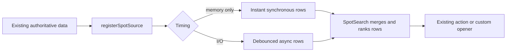
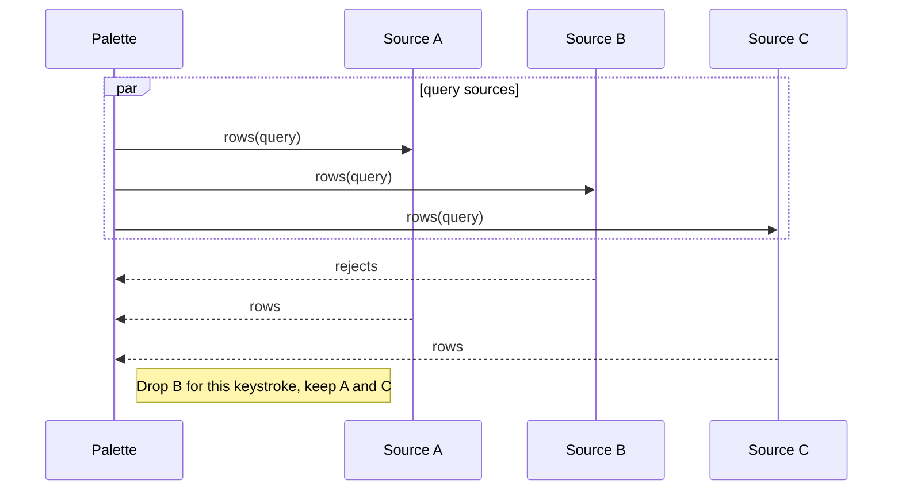

# Contributing a SpotSearch Source

Use this playbook to make another kind of existing Canopy data discoverable in
the command/search palette.

## Registry flow



SpotSearch is a projection, not a new authority. The source should query an
existing store, index, service, or context.

## Files

```text
src/spotSources.ts                  source contract and registration
src/components/spotIcons.tsx        optional row-kind icon
src/spotSources.test.ts             registry and row behavior
src/components/SpotSearch.test.tsx  palette behavior when needed
```

## Steps

1. Identify the authoritative data and its existing cache/query API.
2. Choose a stable source ID. Settings persist disabled IDs.
3. Choose a section label and one-line settings description.
4. Use `instant` only for synchronous in-memory work.
5. Use `deferred` for filesystem, network, LSP, Git, or database calls.
6. Set a sensible minimum query length for expensive sources.
7. Produce stable row IDs, a row kind, title, detail, score, and action.
8. Reuse an existing action. Use a custom action only when the registry cannot
   express the opener.
9. Register an icon only for a genuinely new row kind.
10. Store and call the unregister functions if the source has a shorter
    lifetime than the application.
11. Test source ordering, disabled state, minimum query, rejection isolation,
    action behavior, and cleanup.

## Failure behavior



One source failure must not empty the palette.

## Verification

```sh
npm run test -- src/spotSources.test.ts src/components/SpotSearch.test.tsx
npm run typecheck
```

## Pull request checklist

- [ ] Existing data authority reused.
- [ ] Stable source and row IDs used.
- [ ] Correct instant/deferred timing selected.
- [ ] Expensive source has a minimum query.
- [ ] Failure cannot suppress other sources.
- [ ] Action and optional icon reuse existing registries.
- [ ] Ordering, disable, error, and cleanup behavior tested.
