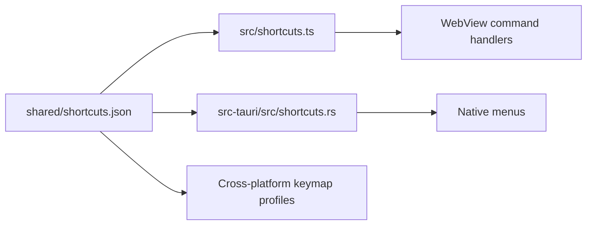
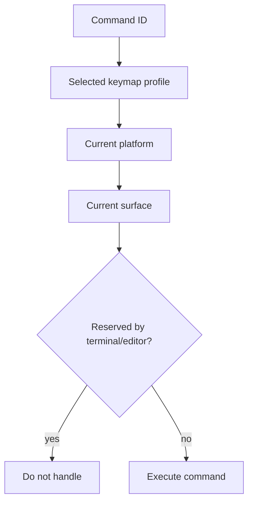

# Contributing a Keyboard Shortcut

Use this playbook to add a command chord shared by WebView handlers and native
menus. The shortcut manifest is the authority.

## Manifest flow



Do not hardcode the same chord independently in React and Rust.

## Files

```text
shared/shortcuts.json          command, profiles, platforms, surfaces, collisions
src/shortcuts.ts               resolver only if the schema needs a new concept
src/<handler>.tsx              command behavior
src-tauri/src/shortcuts.rs     native resolution/parity
src-tauri/src/lib.rs           native menu command, if applicable
src/shortcuts.test.ts          TypeScript behavior and parity
```

## Steps

1. Choose a stable command ID describing the action, not the current chord.
2. Search existing commands and OS/application defaults for collisions.
3. Add the command once to `shared/shortcuts.json`.
4. Define profile defaults and platform overrides.
5. Declare whether it is active in application, terminal, editor, or menu
   surfaces.
6. Document terminal/readline collisions explicitly.
7. Bind the resolved command in the owning WebView handler or native menu.
8. Match by normalized command/chord helpers, not raw `KeyboardEvent` checks.
9. Ensure user-selected keymap profiles flow through both TypeScript and Rust.
10. Test macOS, Windows, and Linux resolution and collision behavior.

## Resolution decision



## Verification

```sh
npm run test -- src/shortcuts.test.ts
cargo test --manifest-path src-tauri/Cargo.toml --no-default-features shortcuts::tests
npm run typecheck
```

## Pull request checklist

- [ ] Stable command ID added once to the manifest.
- [ ] Platform and profile defaults defined.
- [ ] Surface and terminal collision policy defined.
- [ ] Handler uses resolver helpers.
- [ ] Native menu and WebView remain in parity.
- [ ] macOS, Windows, and Linux behavior tested.
- [ ] Documentation names the command, not only the chord.
