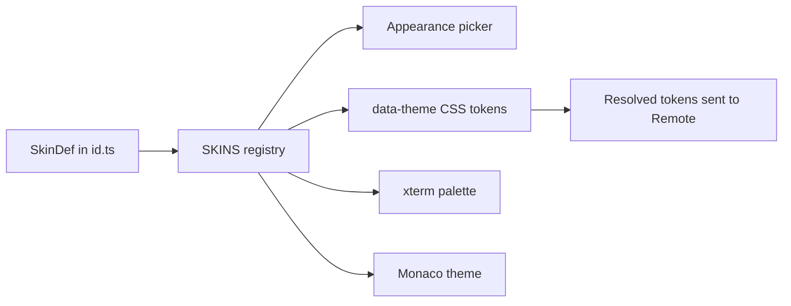

# Contributing a Theme

Canopy calls complete themes **skins**. Use this playbook for a new palette that
must apply consistently to the application shell, Settings preview, terminal,
Monaco editor, and Remote.

## Integration flow



The registry is the only roster. Do not add skin-specific switches to Settings,
the terminal, Monaco, or Remote.

## Files

For a skin named `harbor`:

```text
src/skins/harbor.ts       new SkinDef
src/skins/harbor.css      complete token block
src/skins/skins.css       import the CSS file
src/skins/registry.ts     import and register the SkinDef
src/skins/skins.test.ts   existing completeness guard
```

Use an existing pair such as `orchard.ts` and `orchard.css` as the template.

## Steps

1. Choose a stable lowercase ID. It becomes persisted settings data and the
   `data-theme` attribute, so never rename it after release.
2. Create `harbor.ts` with a title-cased label, short lowercase note, preview
   swatches, all xterm colors, and a Monaco base and background.
3. Create `harbor.css` with `:root[data-theme="harbor"]`.
4. Declare every required palette token, `--accent-soft`, `--ring`, and
   `color-scheme`.
5. For a light skin, override all shadow tokens.
6. Import the CSS in `skins.css` in the same order as the registry.
7. Import the definition and add it to `SKINS` in picker order.
8. Check contrast in app chrome, dialogs, disabled states, terminal ANSI output,
   Monaco, focus rings, and Remote.

## Token rule

Components must use semantic variables such as `--bg`, `--text`, `--border`,
`--accent`, `--danger`, `--ok`, and `--warn`. Do not add a literal color to a
component just to make one skin work.

## Verification

```sh
npm run test -- src/skins/skins.test.ts
npm run typecheck
```

The completeness test checks IDs, picker registration, CSS import order, token
coverage, terminal backgrounds, Monaco surfaces, and preview metadata.

## Pull request checklist

- [ ] Stable ID, label, note, and preview supplied.
- [ ] Complete CSS token block supplied.
- [ ] Full xterm and Monaco palettes supplied.
- [ ] Registry and CSS import order agree.
- [ ] Light/dark `color-scheme` is correct.
- [ ] No component-specific color workaround was added.
- [ ] Desktop, terminal, Monaco, and Remote were inspected.
