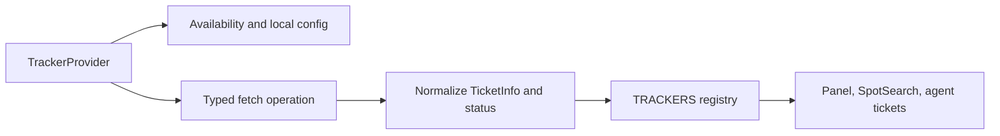
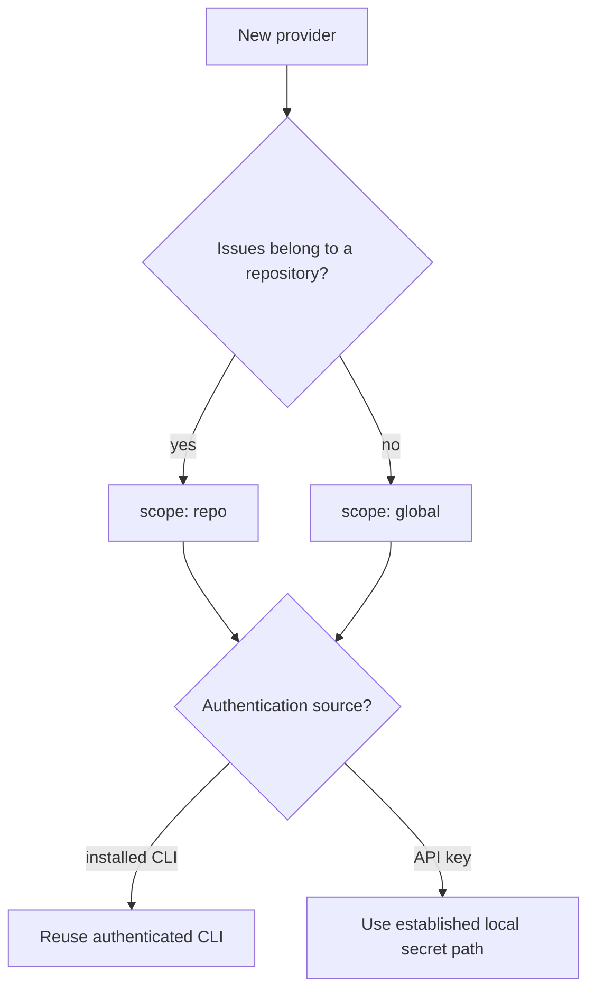

# Contributing an Issue Tracker

Use this playbook to add another issue provider such as GitLab, Jira, or a
self-hosted tracker to the unified Trackers surface.

## Provider flow



The panel iterates the provider registry. Do not add provider-specific branches
to every consumer.

## Files

```text
src/trackers.ts                 TrackerProvider and unified status
src/ipc.ts                      typed wrapper, if native work is needed
src-tauri/src/git.rs or module  CLI/API operation and TicketInfo projection
src/components/TicketsPanel.tsx  provider rendering, only if generic UI lacks a need
src/components/icons.tsx        optional provider icon
```

## Steps

1. Choose a stable provider ID and display name.
2. Decide whether issues are repository-scoped or global.
3. Define availability detection without performing a full fetch.
4. Reuse authenticated local tooling where possible, as GitHub reuses `gh`.
5. If a key is required, store it only through the established local settings
   or vault path and send it only to the provider.
6. Implement a typed fetch that returns the common `TicketInfo` shape.
7. Normalize provider states into `UnifiedStatus`.
8. Preserve branch suggestions when the provider supplies one.
9. Add the provider object to `TRACKERS`.
10. Add an icon through the parametric tracker icon path if needed.
11. Verify panel, SpotSearch, agent handoff, worktree matching, error, and
    disconnected behavior.

## Scope decision



## Verification

```sh
npm run test -- src/components/TicketView.test.tsx
cargo test --manifest-path src-tauri/Cargo.toml --no-default-features git::tests
npm run typecheck
```

Add focused provider-domain tests when the contribution adds normalization or
branch logic not covered by the ticket component.

## Pull request checklist

- [ ] Stable provider ID and correct scope selected.
- [ ] Availability is cheap and actionable.
- [ ] Authentication reuses an established secure path.
- [ ] Common ticket shape and statuses normalized.
- [ ] Generic consumers work without provider-specific switches.
- [ ] Branch/worktree behavior considered.
- [ ] Disconnected, unauthorized, empty, and error states tested.
