# Core Rust System

> This page defines the roles and responsibilities of Canopy's native core. For
> the complete system map, see [Canopy Architecture](./architecture.md). For
> implementation steps, see
> [Contributing a Native Capability](./contributions/native-capability.md).

## 1. Mission

The Rust core is Canopy's native authority. It owns operating-system resources,
privileged operations, durable local data, external process lifecycles, network
listeners, and the security checks around those capabilities. It exposes typed,
bounded projections to the desktop WebView, coding agents, and Canopy Remote.

The core is one Tauri process, not a hosted backend service. Most features work
fully offline. Loopback and network servers exist for narrow, explicit purposes:
agent context, previews, Remote, and peer collaboration.

## 2. Responsibility boundary

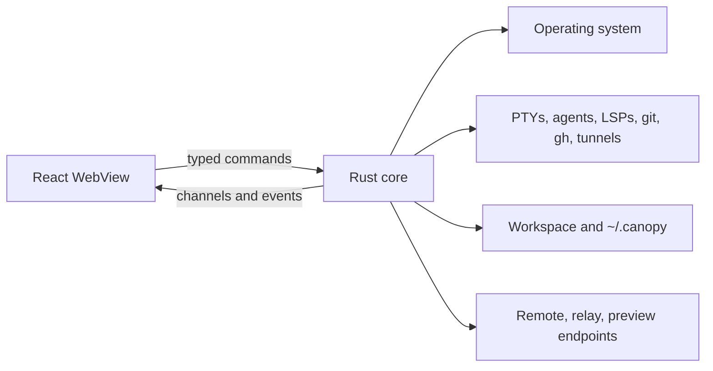

### Rust owns

- PTY creation, streaming, resize, backpressure, process groups, and teardown;
- external process execution and reaping;
- workspace path registration, containment, reads, writes, and watchers;
- Git, GitHub CLI, tracker API, and worktree operations;
- language-server processes and stdio framing;
- agent process evidence, hook integration, session ingestion, and context
  credentials;
- native child WebViews, preview proxies, screenshots, and device automation;
- durable notes, research, provenance, search indexes, profiles, and vault data;
- authenticated loopback and network servers;
- Remote capability enforcement and relay cryptography;
- native notifications, reminders, clipboard watching, dictation, and system
  audio restoration;
- bounded queues, files, bodies, histories, retries, and shutdown.

### Rust does not own

- project tab composition and visual navigation;
- Monaco models and editor selection;
- which open project or panel the user is looking at;
- React component state and presentation;
- renderer-only browser layout and overlay decisions;
- product-level feature policy that is purely presentational;
- cross-shell view composition when pure TypeScript can express it safely.

The frontend publishes renderer-only context when agents need it. Rust should
not recreate the React workspace model merely to avoid a typed boundary.

## 3. Process topology

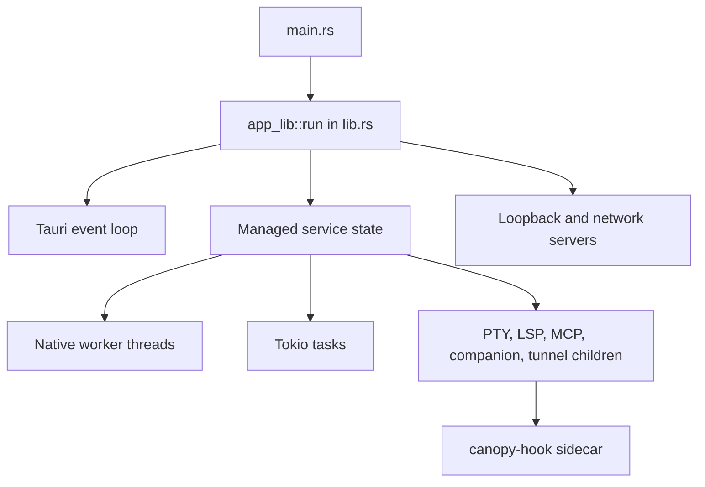

`src-tauri/src/main.rs` is intentionally small. `src-tauri/src/lib.rs` is the
native composition root: plugins, state registration, startup services, command
registration, native menus, and app-exit cleanup all meet there.

`src-tauri/src/bin/canopy_hook.rs` is a second binary. It starts cheaply from
external agent hooks and can act as an MCP stdio bridge without loading Tauri.

## 4. Core service groups

### 4.1 Application runtime and lifecycle

| Module | Responsibility |
|---|---|
| `main.rs` | Native executable entry and delegation to `app_lib::run()` |
| `lib.rs` | Tauri composition root, plugins, managed state, command registry, menus, setup, shutdown |
| `blocking.rs` | Safe choke point for synchronous I/O when called from async commands |
| `procenv.rs` | Process environment and executable resolution helpers |
| `cli.rs` | Single-instance argument forwarding, pending open paths, deep links, CLI shim |
| `crash.rs` | Native panic persistence and opt-in crash reporting flow |
| `selftest.rs` | Launch-time self-test coordination |
| `cleanup.rs` | Workspace cleanup scanning and execution |
| `shortcuts.rs` | Native menu accelerators from the shared shortcut manifest |
| `webview_keys.rs` | Platform-specific suppression of browser accelerators that conflict with the app |

The runtime group coordinates ownership; feature logic should remain in the
module that owns the resource.

### 4.2 Terminals and child processes

| Module | Responsibility |
|---|---|
| `pty.rs` | PTY sessions, raw byte streaming, reader/writer/flusher threads, backpressure, remote scrollback, process-group kill |
| `lsp.rs` | Language-server child processes, stdin writes, `Content-Length` frame parsing, exit events |
| `agents.rs` | Process monitoring, PTY stats, hook bridge, CLI integration install/heal, usage/session sources |
| `agentid.rs` | Resolve real foreground executable/package identity through runtimes, scripts, symlinks, and wrappers |
| `companion.rs` | One structured app-wide companion child with JSON-line stdin/stdout |
| `mcp_client.rs` | MCP stdio/HTTP clients, connection pooling, capability negotiation, idle reaping |
| `tunnel.rs` | Public tunnel provider child process and status |

#### PTY responsibility

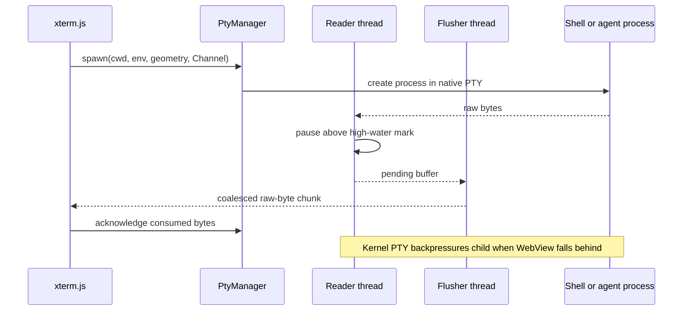

The PTY path must remain raw, ordered, bounded, and fully reaped. Rust owns the
process; xterm.js owns rendering.

### 4.3 Workspace, files, and source control

| Module | Responsibility |
|---|---|
| `fsx.rs` | Registered workspace allowlist, path containment, file commands, recursive watchers, Git invalidation |
| `git.rs` | System `git` and `gh` operations, GitHub/issue operations, worktrees, typed safety outcomes |
| `sync.rs` | Branch synchronization probe, apply, and abort workflows |
| `instructions.rs` | Scan, read, and write agent instruction documents |
| `profiles.rs` | Isolated per-CLI account directories and environment projection without reading tokens |

#### Workspace containment

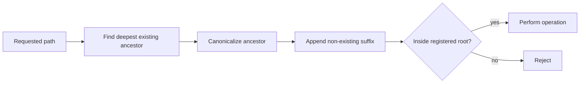

Ordinary file and Git commands must pass this boundary. Native-dialog imports
and clone destinations are explicit exceptions, not precedents for unscoped
commands.

Git shells out to the user's installed tools so credential helpers, SSH keys,
configuration, and hooks continue to work. Read commands disable optional locks;
interactive credential prompts are disabled because they cannot safely appear
behind the WebView.

### 4.4 Durable local data and knowledge

| Module | Responsibility |
|---|---|
| `notes.rs` | Project-scoped scratchpad records, attachments, reminders, atomic persistence |
| `research.rs` | Structured research lifecycle, findings, sources, links, bounded content tiers |
| `provenance.rs` | Session, work, and pull-request provenance records |
| `change.rs` | Debounced, scoped cross-writer store invalidation events |
| `spot.rs` | SQLite FTS5 index, bounded incremental ingestion, query, pruning |
| `stores.rs` | Read-only adapters for external agent transcript/session stores |
| `vault.rs` | Encrypted credential vault, key lifetime, approvals, narrow secret operations |
| `vault_kdbx.rs` | KeePass/KDBX import support |
| `remind.rs` | Reminders that outlive the app process |

#### Store write contract

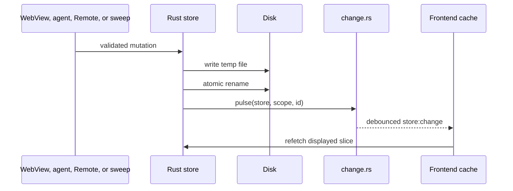

The change event is an invalidation, not a copy of authoritative data. SpotSearch
is a rebuildable derivative, not a source of truth.

### 4.5 Agent integration and context

| Module | Responsibility |
|---|---|
| `context.rs` | Loopback bearer-token HTTP bridge, per-PTY identity, UI request tickets, claims, messages, tool settings |
| `agents.rs` | Hook-file ingestion, session digests, process stats, integration healing |
| `agent_life.rs` | Rust-side lifecycle policy/parity where native consumers need it |
| `mcp.rs` | Discover MCP configuration across supported CLIs, normalize and redact it |
| `mcp_client.rs` | Connect to discovered MCP servers and call tools/resources/prompts |
| `bin/canopy_hook.rs` | External hook receiver/writer and agent-facing MCP stdio server |

#### Agent trust boundary

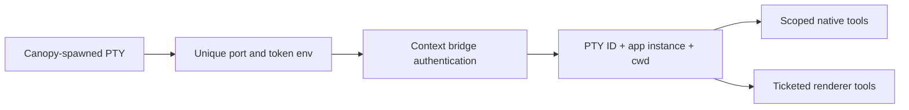

The process-wide root token is trusted but anonymous. It supports the app-wide
companion but cannot impersonate a named terminal agent. Claims are advisory and
messages are attributed; neither outlives the app process.

### 4.6 Browser, preview, device, and media

| Module | Responsibility |
|---|---|
| `browser.rs` | Native child WebViews, navigation policy, bounds, visibility, automation, shared browser profile |
| `preview.rs` | Origin-keyed loopback reverse proxies, HTML instrumentation, network log, redirect handling |
| `snapshot.rs` | WebView/browser image capture with platform-specific implementation |
| `android.rs` | Android SDK/device discovery, emulator control, screenshots, UI tree, input, logcat, APK launch |
| `dictation.rs` / `dictation_stub.rs` | Feature-gated model download, audio capture, transcription, unsupported fallback |
| `sysaudio.rs` | System audio state used during dictation and guaranteed restoration |
| `clipboard.rs` | Clipboard history, watching, status, and cleanup |
| `punch.rs` | STUN public-address discovery for manually forwarded Remote access |

Native browser views are separate OS-level surfaces composited above the DOM.
Rust owns the actual view; React owns layout intent and reports bounds and
visibility.

Preview proxies are not general application servers. They are loopback,
origin-specific adapters that make local development pages observable and
controllable inside Canopy.

### 4.7 Remote access and collaboration

| Module | Responsibility |
|---|---|
| `portal.rs` | Embedded Remote HTTP/WebSocket server, PIN exchange, bearer sessions, snapshots, PTY attach, generic actions |
| `remote/mod.rs` | Fail-closed command grants and least-scope dispatch |
| `remote/streams.rs` | Registered live stream providers |
| `remote/verbs.rs` | Replay-safe/single-flight routing for renderer-owned actions |
| `relay.rs` | Peer host/client roles, SPAKE2 key agreement, encrypted frames, identity pinning, file transfer |
| `wsbridge.rs` | Bridge between blocking encrypted relay streams and async WebSockets |
| `tunnel.rs` | Optional public tunnel process used for internet reachability |

#### Separate network boundaries

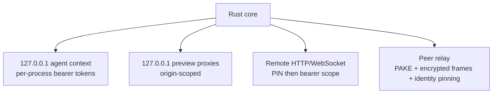

These servers are not interchangeable. Never expose a context or Tauri command
through Remote merely because a local caller can use it.

### 4.8 Notifications and platform integration

| Module | Responsibility |
|---|---|
| `notify.rs` | Native operating-system notifications |
| `remind.rs` | Durable reminder scheduling and delivery |
| `cli.rs` | File/directory open requests and deep-link forwarding |
| `webview_keys.rs` | Platform WebView keyboard policy |
| `snapshot.rs` | Native capture where browser APIs are insufficient |

The React shell decides user-facing attention policy and destinations. Rust
performs the native delivery and forwards activation back through typed events.

## 5. Managed state

Tauri managed state holds live resources whose lifetime is the application.

| Managed state | Owns |
|---|---|
| `PtyManager` | Active PTY sessions and process handles |
| `WorkspaceManager` | Allowed roots and filesystem watchers |
| `LspManager` | Language-server children and stdin handles |
| `RelayManager` | Relay role, peers, sockets, and transfers |
| `RemoteManager` | Remote server, auth session, theme/CLI projection |
| `PreviewManager` | Origin-keyed reverse proxies |
| `BrowserManager` | Native child WebViews |
| `ContextBridge` | Credentials, snapshots, pending UI tickets, claims, messages |
| `StatsCache` | Latest process telemetry |
| `TunnelManager` | Public tunnel child process |
| `PrWatcher` | Background GitHub polling lifecycle |
| `DictationManager` | Model/audio/transcription lifecycle |
| `SpotIndex` | Lazy SQLite connection |
| `NotesStore` / `ResearchStore` | Mutation serialization locks |
| `ProvenanceStore` | Provenance persistence coordination |
| `Vault` | Decrypted vault state and key lifetime |
| `Clipboard` | Clipboard watcher and history |
| `CompanionManager` | One structured companion child |
| `PendingOpen` / `PendingLink` | Cold-start CLI/deep-link requests |

Do not place a durable source of truth only in managed memory. Use managed state
for live handles, coordination, caches, and mutation serialization; persist
durable data explicitly.

## 6. Command and message surfaces

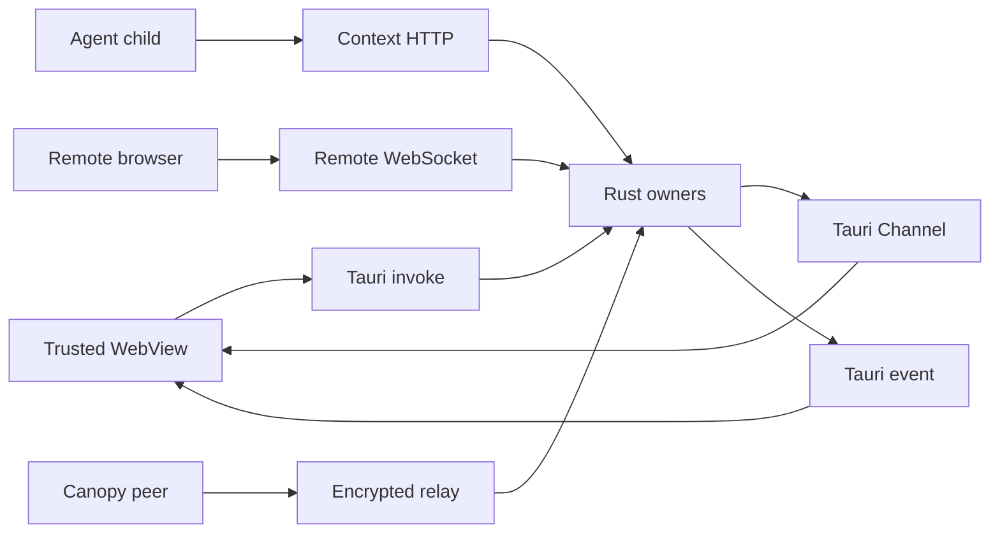

| Surface | Trust | Responsibility |
|---|---|---|
| Tauri command registry | Bundled WebView | Broad desktop operation set |
| Tauri `Channel` | One trusted invocation | Ordered/high-volume streams |
| Tauri events | Trusted WebView listeners | Lifecycle and invalidation |
| Context HTTP | Authenticated child process | Agent-safe tools with derived identity |
| Remote WebSocket | Scoped bearer token | Explicit Rust grants only |
| Relay protocol | Authenticated encrypted peer | Typed collaboration messages |

## 7. Concurrency model

The core intentionally mixes models according to the underlying API.

| Model | Used for |
|---|---|
| Native blocking threads | PTY reads/writes/flush, process monitoring, hook-file bridge, blocking relay peers |
| Tokio tasks | Axum servers, WebSockets, async child I/O, timers, MCP HTTP, debounced events |
| Managed mutexes | Live resource maps, store mutation serialization, credentials, pending requests |
| Atomics | PTY counters/activity, operation IDs, lightweight lifecycle flags |
| Bounded channels/rings | PTY output, remote streams, process output, relay queues |

Rules:

- never hold a mutex across an `await`;
- drain child stdout and stderr so a pipe cannot deadlock the process;
- put synchronous system commands behind the blocking boundary;
- cap channels and define lag/recovery behavior;
- use one owner for each child process;
- kill and reap, rather than dropping a handle and hoping;
- make retries idempotent or single-flight where clients reconnect.

## 8. Persistence map

```text
~/.canopy/
|- projects.json or workspace store      project registration
|- sessions/ and agent-events.jsonl      agent hook/session evidence
|- notes/<project>/<item>/               scratchpad records and attachments
|- research/<project>/<item>/            findings and raw sources
|- profiles/<id>/                        isolated CLI homes
|- vault.enc                             encrypted credentials
|- spot-index.sqlite                     rebuildable search index
|- relay-identity                        long-term peer identity seed
`- relay-known-peers.json                trust-on-first-use peer pins
```

Exact filenames can evolve. The architectural distinction must not:

- authoritative user data uses atomic persistence and validation;
- external CLI stores are read-only inputs;
- search indexes and caches are rebuildable;
- secrets remain encrypted or inside the owning CLI's profile;
- ephemeral claims, pending tickets, and message history stay process-local.

## 9. Startup and shutdown

### Startup

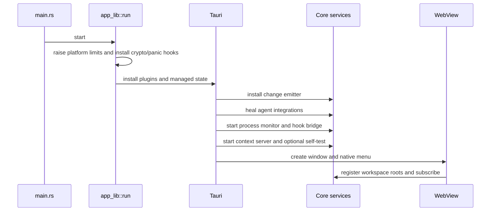

### Shutdown

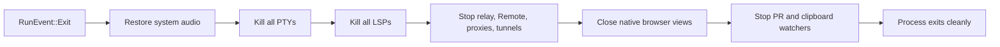

Any new long-lived native service must join both startup ownership and shutdown
cleanup. A command that starts a resource without a deterministic stop path is
incomplete.

## 10. Security responsibilities

The Rust core enforces, rather than merely documents:

- canonical workspace path containment;
- command registration and argument deserialization;
- per-PTY agent authentication and identity;
- Remote command allowlisting and scope checks;
- URL scheme restrictions for native browser navigation;
- encrypted relay frames and peer identity pinning;
- vault encryption, key zeroization, approval, and narrow secret exposure;
- payload, file, body, queue, history, and timeout limits;
- process cleanup and credential retirement;
- atomic writes and path containment for attachments and sources;
- redaction of MCP secrets before serialization to UI.

Security decisions belong at the authoritative boundary. Hiding a button in
React is not authorization.

## 11. Extending the core

### Add a command to an existing owner

1. Implement and test the operation in the owning module.
2. Apply workspace, URL, identity, and size validation.
3. Register it in `tauri::generate_handler!`.
4. Add one typed wrapper in `src/ipc.ts`.
5. Keep Remote denied unless separately granted.

### Add a managed service

Use a managed service only when the core must retain live handles or coordinate
operations across calls.

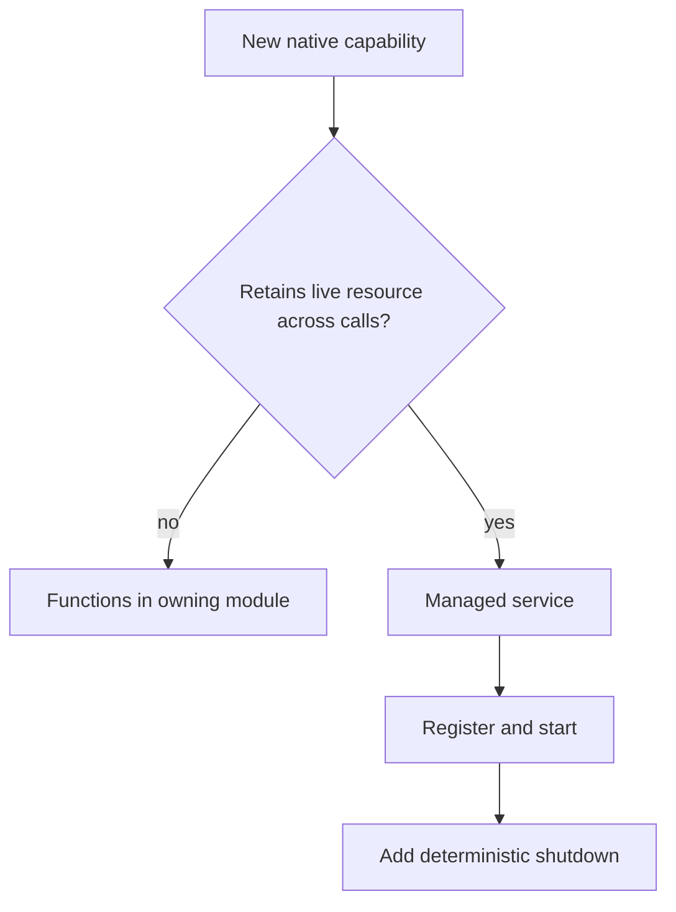

### Add a network surface

Do not create a new listener until the context bridge, preview proxy, Remote
server, relay, and MCP client have all been ruled out. A new listener requires a
separate threat model, authentication, bind-address decision, protocol limits,
shutdown path, and tests.

## 12. Core review checklist

- [ ] Rust is the correct owner for the capability.
- [ ] One module or manager owns every live resource.
- [ ] Inputs are authenticated, validated, scoped, and bounded.
- [ ] Correct invoke/channel/event/network surface selected.
- [ ] Blocking, async, thread, and mutex behavior is explicit.
- [ ] No lock is held across `await`.
- [ ] Child pipes are drained and processes are killed and reaped.
- [ ] Durable writes are atomic and invalidate readers from the write boundary.
- [ ] Remote and agent exposure are separate explicit decisions.
- [ ] Startup, cancellation, timeout, and shutdown are implemented.
- [ ] Platform-specific behavior has an honest unsupported path.
- [ ] Focused Rust tests cover validation, failure, and cleanup.
