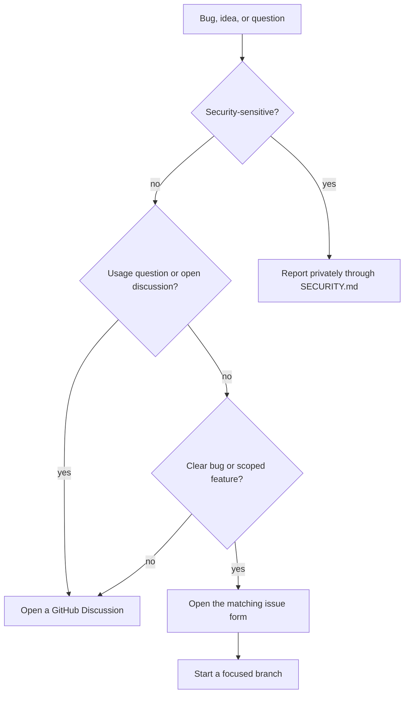
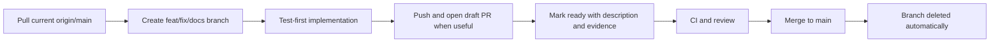
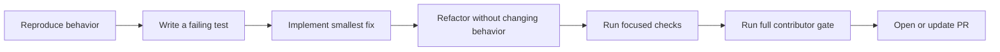
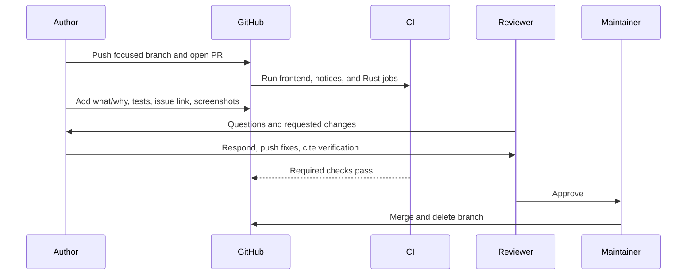
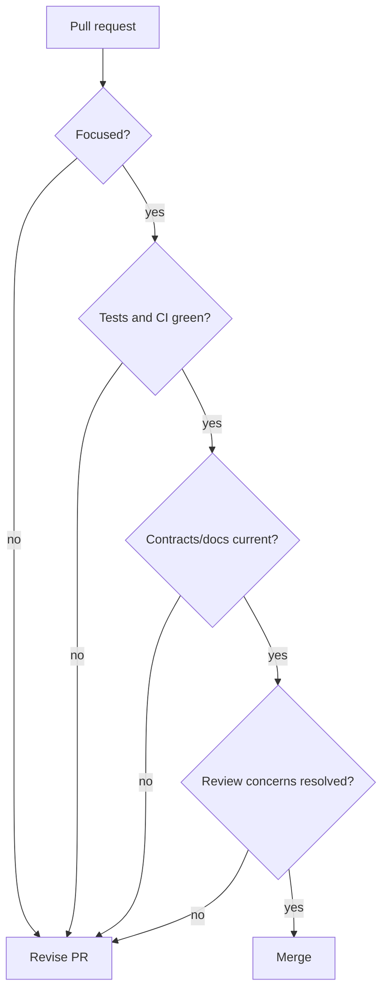

# Pull Request Etiquette

> This guide explains how to propose, review, and merge changes in Canopy. The
> technical setup and test-first workflow are in
> [CONTRIBUTING.md](../CONTRIBUTING.md).

## 1. Before writing code

Choose the smallest public path that fits the idea:



- Search open issues, pull requests, discussions, notes, and research before
  duplicating work.
- For a substantial design change, align on the problem and boundary before
  building the full solution.
- Security vulnerabilities never belong in a public issue or pull request.
- Keep unrelated cleanup out of the change. Record adjacent work separately.

## 2. Branch and scope

Use a descriptive branch name:

```text
feat/remote-search
fix/pty-backpressure
docs/contributor-guide
test/collab-disconnect
chore/update-notices
release/v0.4.0
```

### Naming convention

| Change | Branch | Pull request title |
|---|---|---|
| User-facing capability | `feat/<short-kebab-name>` | Imperative outcome, for example `Add project-scoped search filters` |
| Bug fix | `fix/<short-kebab-name>` | Name the corrected behavior, for example `Keep claims inside the active project` |
| Documentation | `docs/<short-kebab-name>` | Name the documentation outcome, for example `Document the Remote trust boundary` |
| Tests only | `test/<short-kebab-name>` | Name the protected behavior, for example `Cover relay reconnect replay` |
| Performance | `perf/<short-kebab-name>` | Name the measurable improvement, for example `Stop polling inactive project stats` |
| Refactor | `refactor/<short-kebab-name>` | Name the boundary being simplified without claiming new behavior |
| Maintenance | `chore/<short-kebab-name>` | Name the repository maintenance outcome |
| Release cut | `release/vX.Y.Z` | Exactly `Release vX.Y.Z` |

Branch names are lowercase kebab-case, concise, and free of contributor names or
machine-specific terms. Add an issue number only when it improves recognition,
for example `fix/412-preview-resize`.

Pull request titles are sentence case, imperative, and describe the result a
reviewer will evaluate. Do not use only an issue number, branch name, agent task
name, “WIP,” or “misc fixes.” A Conventional Commit prefix is optional; clarity
is required. Release PR naming is fixed because automation and maintainers need
to recognize the cut immediately.

A pull request should represent one reviewable outcome. It may cross React,
Rust, shared contracts, tests, and docs when one behavior requires all of them;
“focused” does not mean “one file.” It means every changed file serves the same
reason.

Avoid:

- drive-by renames or formatting;
- dependency updates unrelated to the behavior;
- generated artifacts unless the repository tracks them intentionally;
- copied implementations beside an existing registry, adapter, or bus;
- secrets, personal tokens, local paths, or private data;
- changes from another contributor's worktree or agent session.

### Feature cut lifecycle

Canopy uses short-lived branches from `main`; there is no long-lived `develop`
branch.



Rules:

1. Cut every feature, fix, or documentation branch from current `origin/main`.
2. Do not stack unrelated work on another feature branch.
3. If one change truly depends on an unmerged PR, state the dependency and base
   the temporary PR correctly; rebase or retarget it to `main` after the
   dependency merges.
4. Pull current `main` before final review and resolve conflicts without dropping
   upstream work.
5. Merge through GitHub after CI and review; do not push directly to protected
   `main`.
6. Let GitHub delete the merged branch. Cut follow-up work from `main`, not from
   the deleted branch.

## 3. Build test-first



- Put the test at the layer that owns the rule.
- Watch a regression test fail before implementation.
- Assert observable behavior, not private implementation.
- For a documentation-only change, validate links, examples, diagrams, and the
  generator or command the documentation introduces; explain why application
  tests were not rerun.
- For UI changes, include screenshots or a short recording when visual review
  adds information tests cannot.
- For platform-specific changes, state which platforms were exercised and which
  remain unverified.

The complete test model is in
[Testing and Coverage](./testing-and-coverage.md).

## 4. Commit etiquette

Write concise, imperative commit subjects that describe the outcome:

```text
Add scoped browser viewport resize
Prevent stale claims crossing projects
Document the Remote capability boundary
```

Good commits:

- compile or make sense as a review unit;
- do not include secrets or machine-local artifacts;
- explain non-obvious constraints in the body when needed;
- preserve attribution when incorporating another person's work;
- avoid “fix stuff,” “WIP,” or generated summaries with no useful subject.

The repository permits squash, merge, and rebase merges. Maintainers choose the
merge strategy appropriate to the commit history. Do not force-push over review
without warning; it invalidates reviewers' references to earlier commits.

## 5. Open the pull request

The pull request template asks for three things:

1. **What and why:** describe user-visible behavior and the reason for changing
   it. Link the issue with `Closes #123` when merge should close it.
2. **How it was tested:** list exact commands and manual checks. State any gap.
3. **Checklist:** complete the required frontend and Rust gates, or explain why
   an item does not apply.



Open a draft pull request when early CI or design feedback will prevent wasted
work. Mark it ready only when the description is complete, the intended scope is
implemented, and known failures are disclosed.

## 6. Required checks

Before requesting final review:

```sh
npm run typecheck
npm run lint
npm run test
npm run build
cargo test --manifest-path src-tauri/Cargo.toml --no-default-features
```

CI runs frontend typecheck/lint/tests, third-party notice validation, Rust tests,
and rustfmt. Clippy is currently advisory. A green CI run does not replace
feature-specific manual checks.

If a new dependency is added, regenerate and verify
`THIRD-PARTY-NOTICES.md` with the existing license commands.

## 7. Review etiquette

### For authors

- Respond to every substantive review comment: fix it, clarify it, or explain
  the tradeoff respectfully.
- Push focused follow-up changes and say what changed.
- Do not mark another person's unresolved concern as addressed without a
  response.
- Re-request review after meaningful updates.
- Keep the PR description current when scope changes.
- Resolve merge conflicts without dropping upstream work.
- If the approach is no longer right, close the PR with a brief explanation.

### For reviewers

- Review correctness, security, behavior, regression risk, tests, and ownership
  before style preferences.
- Distinguish blockers from suggestions and questions.
- Explain the reason behind requested changes.
- Avoid expanding the PR into unrelated refactoring.
- Check the negative path, cleanup, limits, and platform behavior.
- Acknowledge when a concern has been addressed.

### For agent-authored changes

The human or maintainer submitting the PR remains accountable for the result.
Review generated code, verify cited commands actually ran, remove machine-local
artifacts, and make sure the description explains the product decision rather
than merely repeating a generated diff summary.

## 8. Merge readiness

A PR is ready to merge when:

- the outcome and motivation are clear;
- the change remains focused;
- required tests and CI pass;
- new behavior has an appropriate test or a documented reason it cannot;
- security, path scope, bounds, and cleanup are addressed;
- user-facing behavior and contributor contracts are documented;
- review conversations are resolved;
- no unrelated or generated local files are included;
- the branch is compatible with current `main`.



Branches are deleted automatically after merge. GitHub Releases, not merged PR
titles alone, are the canonical user-facing version history.

## 9. PR checklist for authors

- [ ] Searched for existing work and linked the relevant issue/discussion.
- [ ] Kept one reviewable outcome in scope.
- [ ] Reused existing architecture and extension points.
- [ ] Added a failing test before behavior changes.
- [ ] Ran focused checks and the complete contributor gate.
- [ ] Added visual/platform evidence where appropriate.
- [ ] Explained what changed, why, and how it was tested.
- [ ] Disclosed test or platform gaps.
- [ ] Removed secrets, local artifacts, and unrelated changes.
- [ ] Responded to review and kept the PR description current.
