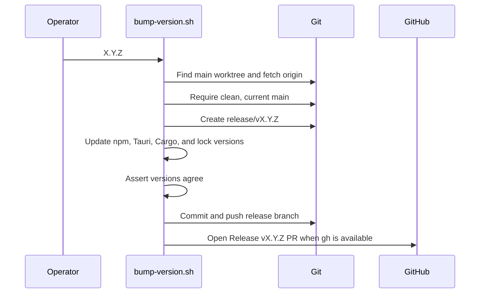
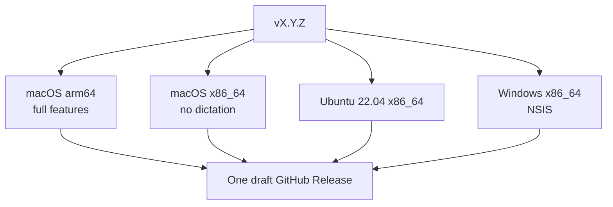
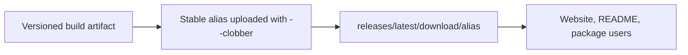

# Release Process

> This is the illustrated release lifecycle. The operator quick reference is
> [RELEASING.md](../RELEASING.md); the implementation lives in
> `scripts/bump-version.sh` and `.github/workflows/release.yml`.

## 1. Release principles

- Releases come from an up-to-date, protected `main` branch.
- The version bump is reviewed in its own pull request.
- The release tag is created on `main` **after** that PR merges.
- A tag triggers native builds on each operating-system runner.
- CI creates a draft GitHub Release; maintainers inspect it before publishing.
- Publishing, not tagging, makes the release current and starts updater rollout.
- Stable installer aliases must not change because the website and README use
  permanent `releases/latest/download/...` URLs.

## 2. End-to-end flow

```mermaid
flowchart LR
  Main[Fresh origin/main]
  Bump[Run bump-version.sh X.Y.Z]
  Branch[release/vX.Y.Z]
  PR[Version bump PR]
  Merge[Merge into main]
  Tag[Run bump-version.sh --tag X.Y.Z]
  CI[Multi-platform release workflow]
  Draft[Draft GitHub Release]
  QA[Artifact and install QA]
  Publish[Publish release]
  Update[Latest links and updater activate]

  Main --> Bump --> Branch --> PR --> Merge --> Tag --> CI --> Draft --> QA --> Publish --> Update
```



The two phases prevent a tag from pointing at a release-branch commit that is
later replaced by a squash merge.

## 3. Phase 0: choose and prepare the version

Before starting:

1. Confirm all intended feature and fix PRs are merged.
2. Review open release blockers and CI on `main`.
3. Choose the semantic version `X.Y.Z`.
4. Confirm no local or remote `vX.Y.Z` tag exists.
5. Confirm required signing and notarization credentials are available.
6. Ensure the main worktree is clean.
7. Prepare user-facing release notes for the draft review.

Canopy is pre-1.0, but release numbers still communicate scope:

- patch: fixes and compatible refinements;
- minor: new features or meaningful product changes;
- major: reserved for a stable contract or intentionally breaking release.

## 4. Phase 1: version bump pull request

Run:

```sh
./scripts/bump-version.sh X.Y.Z
```

The script:



The release PR must contain only the version bump and lockfile consequences.
Review its file list and version agreement, let CI complete, then merge it using
the normal [pull request etiquette](./pull-request-etiquette.md).

## 5. Phase 2: tag merged main

After the release PR merges:

```sh
./scripts/bump-version.sh --tag X.Y.Z
```

The script checks that:

- the tag does not already exist locally or remotely;
- `main` is fast-forwarded from origin;
- `package.json`, `src-tauri/Cargo.toml`, and
  `src-tauri/tauri.conf.json` all equal `X.Y.Z`.

It then creates and pushes `vX.Y.Z`. Do not create the tag on the release branch
or move an existing release tag to another commit.

## 6. CI build matrix

The pushed tag triggers `.github/workflows/release.yml`.



| Target | Primary artifacts | Update behavior |
|---|---|---|
| macOS Apple Silicon | `.dmg`, app updater archive and signature | in-app updater |
| macOS Intel | `.dmg`, updater archive and signature; dictation disabled | in-app updater |
| Linux x86_64 | AppImage, `.deb`, `.rpm`, updater signature | AppImage in-app; packages via package manager |
| Windows x86_64 | NSIS setup executable and updater artifacts | in-app updater; currently unsigned |

Each runner installs dependencies, builds the sidecar and portal through the
Tauri build hooks, stages the matching ONNX Runtime when dictation is enabled,
and uploads assets into the same draft release.

## 7. Signing and secrets

The workflow depends on repository secrets for:

- Tauri updater private key and password;
- Apple signing certificate, certificate password, identity, account,
  app-specific password, and team ID.

Secret values never belong in the repository, Wiki, logs, issue, or pull request.
The updater public key is compiled into the application. Losing the private key
would prevent already-installed copies from accepting future updates, so it
must be backed up securely outside the repository.

The workflow explicitly verifies updater `.sig` files because a Tauri build can
exit successfully even when updater signing failed.

## 8. Stable download aliases

The release includes version-independent aliases:

```text
Canopy-macos-arm64.dmg
Canopy-macos-intel.dmg
Canopy-linux-x86_64.AppImage
Canopy-linux-x86_64.deb
Canopy-linux-x86_64.rpm
Canopy-windows-x86_64-setup.exe
```



Changing an alias breaks published download links. Update the workflow, README,
and website together if a rename is ever unavoidable.

## 9. Draft release QA

Do not publish immediately after CI turns green. Review the draft as a release
candidate.

### Asset checks

- [ ] Every matrix target completed or has an understood blocker.
- [ ] Expected installers and updater archives exist.
- [ ] Updater `.sig` files exist.
- [ ] `latest.json` exists and points at the intended version.
- [ ] Every stable-name alias exists.
- [ ] Release title, tag, version, and notes agree.
- [ ] No logs or assets expose credentials.

### Installation checks

- [ ] Install and launch the Apple Silicon DMG.
- [ ] Verify macOS signature, notarization, and Gatekeeper behavior.
- [ ] Smoke-test Intel macOS behavior when available, including no dictation.
- [ ] Launch the Linux AppImage on a compatible x86_64 system.
- [ ] Install at least one package-manager artifact when release risk warrants it.
- [ ] Install and launch the Windows NSIS artifact; confirm the documented
      SmartScreen warning while it remains unsigned.
- [ ] Confirm the version in About and updater metadata.
- [ ] Smoke-test a terminal, agent launch, project open, and update check.

### Documentation checks

- [ ] README platform links resolve to the expected stable aliases.
- [ ] Website download links match the aliases.
- [ ] GitHub release notes describe user-visible changes and limitations.
- [ ] Security or migration notes are prominent when needed.

## 10. Publish and observe

Publishing the draft:

- makes it the latest public release;
- activates stable `releases/latest/download/...` links;
- exposes `latest.json` to installed copies;
- begins in-app update availability.

After publishing:

1. Verify the public release page and all stable download links.
2. Check one installed copy can discover the update.
3. Monitor new issues, Discussions, and update failures.
4. Keep GitHub Releases as the canonical changelog.
5. Do not rewrite or move the published tag.

## 11. Dry runs and local macOS releases

Run the GitHub workflow manually with `workflow_dispatch` to exercise the build
matrix without a release tag. With no tag, upload steps are skipped.

For a local signed macOS build:

```sh
./scripts/release-macos.sh aarch64
./scripts/release-macos.sh x86_64
./scripts/release-macos.sh both
```

The script preflights signing, updater key, and notarization before building,
then signs, notarizes, staples, and runs Gatekeeper assessment.

## 12. Failure and rollback etiquette

- If CI fails transiently and the tagged commit is correct, rerun failed jobs.
- If code or version metadata is wrong, fix it through a pull request and cut a
  new patch version. Do not move a public tag to a different commit.
- Never publish an incomplete draft to “fix later.” Installed copies trust the
  published updater metadata.
- If a bad release is published, stop promotion, document impact, fix forward in
  a new patch release, and use the Security Policy for sensitive incidents.
- Package-manager rollback and updater behavior differ by platform; describe
  any required user action in the release notes.

## 13. Release checklist

- [ ] Intended changes merged and `main` CI green.
- [ ] Version selected and release notes prepared.
- [ ] Phase 1 version-bump PR created, reviewed, green, and merged.
- [ ] Phase 2 tag created from updated `main`.
- [ ] All platform builds completed.
- [ ] Signatures, updater JSON, installers, and stable aliases verified.
- [ ] Platform smoke checks completed or gaps documented.
- [ ] Draft release notes and limitations reviewed.
- [ ] Draft published deliberately.
- [ ] Public downloads and updater checked after publication.
