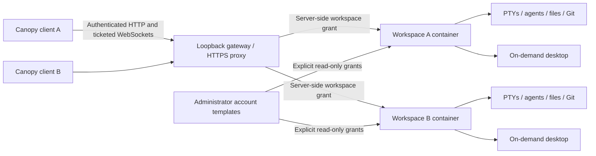

# Remote execution as a Canopy ownership boundary

Research and implementation: 2026-10-02. “IDs” is interpreted as authenticated
users/IDE clients. Several clients may share a principal; several principals may
share a VM, with workspace membership determining access.

## What existing projects establish

| Project/source | Verified implementation or contract | Canopy decision |
| --- | --- | --- |
| [T3 Code architecture](https://github.com/pingdotgg/t3code/blob/main/docs/internals/overview.md) | Execution, filesystem, Git and credentials belong to an environment server. Clients negotiate capabilities and subscribe to selected state. | Select remote mode before local IDE imports; no automatic local execution fallback. |
| [T3 remote access](https://github.com/pingdotgg/t3code/blob/main/docs/user/remote-access.md) | CLI hosts, SSH forwarding, multiple connected devices, and a desktop mode without a local environment. | A cloud-independent headless host, SSH-compatible loopback endpoint, and persisted client mode. |
| [T3 environment auth](https://github.com/pingdotgg/t3code/blob/main/docs/internals/environment-auth.md) | Scope checks remain necessary after socket authentication; bearer clients exchange credentials for short-lived WS tickets. Projects are explicitly not filesystem sandboxes. | Membership checks on every operation, one-use stream tickets, and container isolation rather than treating directories as tenant boundaries. |
| [T3 orchestration engine](https://github.com/pingdotgg/t3code/blob/main/apps/server/src/orchestration/Layers/OrchestrationEngine.ts) | Command receipts and aggregate checks prevent retrying an accepted command against a different target. Its current command queue and event pubsub are unbounded. | Bind spawn receipts to exact arguments; cap requests, receipts and streams rather than copying the unbounded queues. |
| [OpenHands remote workspace](https://github.com/OpenHands/software-agent-sdk/blob/main/openhands-workspace/openhands/workspace/remote_api/workspace.py) | Remote API workspace implementation abstracts remote execution and workspace operations. | Keep execution ownership outside the renderer. This source does not establish Canopy's required account-pool or tenant isolation semantics. |
| [noVNC](https://github.com/novnc/noVNC) | Browser-based VNC over WebSockets, available as a reusable client library. | Lazy-load it for an authenticated, workspace-specific desktop stream. |

These are design learnings; no T3 or OpenHands source was copied. noVNC is a
direct dependency, with its MPL-2.0 notices retained. It is not used to host the
IDE itself: a desktop is an optional view into an independently running workspace.

## Current implementation

The desktop mounts the same IDE for local and remote workspaces. A global title-bar selector installs an immutable workspace host before renderer registration, projects or terminals mount. Switching reloads the renderer after checking unsaved buffers. Agent cards, shells, restored terminals and file operations use the selected host; failed remote operations never execute locally. Connection credentials stay in native process memory across renderer reloads and are not persisted in preferences.

The native workspace adapter sends bounded authenticated RPC to a container-local Linux command service, and terminal I/O uses one-use WebSocket tickets with bounded replay. The macOS renderer watchdog stays native. Project and terminal metadata live in the workspace's persistent home. Docker images install all nine launcher-supported agent CLIs, Git, GitHub CLI and an on-demand XFCE desktop. Desktop viewing opens alongside the IDE and disconnecting the viewer leaves agent execution alive.

Advanced native features that have not been ported (including structured companion execution and agent hook bridges) fail explicitly. The current adapter does not claim full command parity or automatic VM failure recovery.

Account templates are operator-owned Docker volumes. Explicit grants permit
private or shared pools; selected credentials are copied into a session home so
concurrent sessions never mutate the same profile. Per-session refresh is local
to that copy. An operator login/renewal tool publishes immutable credential
generations behind an atomic current pointer. Provider-specific health checks,
automatic renewal and concurrency leases remain outside this implementation.

The gateway is not a cloud scheduler. It manages one Linux host with fixed
workspace CPU, memory and PID budgets. Configured memory limits cannot spend
the host's protected 2 GiB reserve. The native desktop app may still own local
PTYs from a previous local-mode session; switching mode detaches their channels
without silently stopping user work.

## Practical limits and next integration boundary

The implemented code in this change is a remote workspace client with terminals,
agent commands, build-command sessions, Git status/diff, a text file editor,
on-demand JavaScript/TypeScript language diagnostics, and desktop access. It
does not claim parity for the full local Build workflow, integration tools,
other language servers or the complete Git UI. The existing SocketHost/portal contract remains
unchanged; the portable execution API is versioned under `/v1` and does not widen
the desktop portal's grants. Full parity requires moving those service handlers
out of Tauri AppHandle ownership and negotiating them as server capabilities.

PTYS survive a client disconnect and a gateway restart. They do not survive
workspace-container or VM termination. Bounded acceptance receipts and session metadata survive runner restarts;
unfinished work is reported as interrupted without an automatic respawn. An
SSH deployment script installs the portable systemd host. Full event replay,
failover, credential-vault UI, cross-host routing and automatic CLI resume after
VM restart require additional milestones. The current config does
not implement hostile-tenant isolation or public signup.

Acceptance evidence must distinguish synthetic protocol tests, real Linux
container smoke tests, release packaging and deployed VM behavior. A passing
frontend build alone does not establish live remote execution or low long-run
memory growth.

## Validation evidence

- Full frontend suite: 357 files / 4005 tests passed; typecheck and production
  build passed. The changed-file lint and license notice check passed.
- Host suite: twelve tests passed, including cross-workspace denial, viewer
  mutation denial, request-id races, 33-user global admission saturation,
  reconnect replay, Docker error redaction, container configuration drift, durable restart
  receipts, pending-spawn capacity races, private-token initialization and ticket expiration.
- Real Linux arm64 and amd64 images built successfully. Two synthetic workspace
  containers verified real PTY input/exit, idempotent spawn, reconnect to the
  same process, isolated files, private-account denial, shared template copy
  isolation, configured cgroup limits and container reuse.
- An isolated Chrome profile loaded the production Canopy client, started a
  remote session and rendered a 1280×800 noVNC desktop. Closing the desktop and
  disconnecting the client preserved remote work. Request inspection confirmed
  no local IDE/Monaco chunks loaded, and noVNC loaded only on desktop demand.
- Smoke-test containers, volumes, networks, and browser profiles were cleaned
  up. The built workspace image remains available locally. No production data
  or provider credentials were used in validation.

A native release executable compiled successfully. Real Linux analysis also
reported the expected seeded TypeScript type error. A browser soak recorded
6-25 MiB JS heap and approximately 101-114 MiB workspace memory over its first
10 minutes, then failed because Docker Desktop encountered a no-space error.
That run is incomplete and is not a passing 30-minute soak.

Not validated by these checks: a deployed EC2 VM, actual provider-account
authentication/renewal, full local-feature parity, or
the runbook's native WebKit long-duration memory profiles. The earlier blank
window's exact retained-object/GPU cause remains unproven; the fixes bound two
confirmed accumulation paths and remote mode changes execution ownership.

- Final native renderer-recovery selftest passed three replacement cycles with
  six PTYs across two projects, injected registration/listener failures, zero
  lost markers and zero duplicate tabs.
- The final arm64 production-client smoke passed with the native connection
  policy applied, real TypeScript diagnostics, terminal/desktop streams and
  no local editor dependency graph loaded. A startup ternary initially caused
  Vite to preload both graphs; separate import branches resolved it and the
  production request assertion now passes.
- Local amd64 runtime smoke was interrupted by Docker's corrupted snapshot
  state following its disk-full failure. The image build passed; runtime
  coverage is also wired to a fresh native Linux CI job. That CI result is not
  yet claimed here.

- The Apple Silicon DMG was built, checksum-verified, mounted, and its app/hook
  Developer ID signatures passed strict verification. Notarization is blocked
  by Apple HTTP 403 for a missing or expired developer agreement.

Remote workspace connections are now saved in the macOS Keychain. The config
file stores only the selected workspace identity; reopening Canopy restores
its endpoint and credentials without putting tokens in project files or
localStorage. Setup offers an unchecked option to copy the Mac's Claude Code
and Codex logins into the selected workspace's private home. The same action
is available for an existing workspace. It copies agent credential files only,
not project data, SSH keys, shell environment or shared account templates.
Linux receives atomically replaced credential files with mode 0600 in 0700
directories. Actual provider acceptance and refresh of copied credentials
remain dependent on the provider; the import tests use synthetic credentials.

Clicked Claude/Codex browser login URLs with loopback callbacks prepare a
short-lived Mac localhost listener. It validates the original OAuth state and
forwards the callback through the authenticated selected-workspace API to the
container's localhost listener. The original authorization URL and PKCE flow
remain intact. Pending logins retain their original workspace ownership even
if the global selector changes. Occupied Mac ports fail explicitly; provider
device-code/manual-code login remains an alternative.

Remote terminal transport restores a bounded serialized terminal screen on
reattachment, tracks terminal dimensions with each output frame and releases
one frame after the renderer parser acknowledges it. The Linux headless screen
uses the same Unicode widths as the renderer. Resize and output parsing are
ordered, stale attachment generations cannot detach new streams, and input
keystrokes remain ordered. Validation covered a real Linux full-screen menu,
rapid redraws, resized windows and reconnection to the same running process.

## Native project setup and account handoff

The selected workspace owns the normal IDE project store. New project and Edit
project use the same component model locally and remotely; the remote directory
picker lists VM folders beneath `/workspace`, supports several component folders,
and can create a folder. Clone from git runs in the VM and registers the resulting
checkout as a component. Multiple projects and component run commands persist in
the workspace HOME on retained storage.

The workspace menu offers an explicit GitHub login/Git identity copy and selected
local-project import. Import clones Git origins and remaps component subdirectories;
it does not upload local edits, environment files, project data or SSH keys. Run
commands are an optional separate choice. GitHub SSH origins are cloned via HTTPS
so the imported GitHub account can authenticate through `gh auth setup-git`.

Remote browser-open requests use the container's `BROWSER`/`GH_BROWSER` helper or
`xdg-open` shim, enter a bounded private queue, and appear as an Open browser action
in Canopy. Clicking it routes through the existing state-checked Claude/Codex
loopback callback relay. Copied sign-in URLs can be opened from the workspace menu
through the same path. GitHub device-code login opens the Mac browser while the VM
CLI polls for completion; it requires no loopback callback. Agent sign-ins requiring
other provider-specific callback protocols remain explicit rather than silently
falling back to local execution.

The titlebar shows CPU normalized to the selected container's quota and memory
current/max from cgroup v2. These counters cover its agents, shells, cache and
desktop; they are not Mac process statistics or the shared VM's total load. Failed
sampling displays unavailable, and the first CPU sample has no percentage until a
second reading arrives. Desktop has a labeled titlebar control and a workspace-menu
entry.

For other providers, Open sign-in in remote desktop first starts the authenticated
workspace desktop, then opens Chromium inside that workspace and shows its noVNC
view. Browser redirects to localhost therefore reach the VM CLI directly. This
fallback is independent of the Mac callback provider allowlist and does not expose
any VM callback port to the public network.
