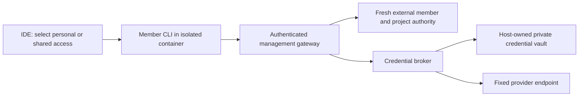

# Shared credential execution

The workspace owner's sharing grant allows a member to perform an operation on a
selected project. It does not give that member another user's login files. Personal
accounts remain in that member's isolated runtime. Administrative credentials and
provider credentials used by the shared broker stay outside development containers.

`packages/remote-host/credential-broker.mjs` implements the operation core. A request
contains a project ID, one allowed operation and a bounded payload. It cannot supply
an account ID, credential, provider URL, authentication header or repository. The
trusted authority returns the selected account reference bound to the exact
workspace/member/project/operation. The vault lookup is also workspace/account-bound.
Authorization is checked again after vault I/O. Transport errors are generic and
provider response headers are restricted to content type and cache policy.

Current adapters support GitHub smart HTTP fetch/push, Anthropic Messages with an
API key and OpenAI Responses with an API key. Git fetch and push require distinct
grants, and the repository comes from trusted account configuration. Agent adapters
use fixed HTTPS origins and reject redirects. These API-key adapters do not establish
support for shared Claude/Codex subscription logins. Personal subscription accounts
must continue working independently; do not silently switch their billing to API keys.

Provider integration references checked 2026-10-05:
- [Claude Code gateway configuration](https://code.claude.com/docs/en/llm-gateway).
- [Codex provider and token-command configuration](https://developers.openai.com/codex/config-reference).
- [GitHub installation tokens and HTTP Git](https://docs.github.com/en/apps/creating-github-apps/authenticating-with-a-github-app/authenticating-as-a-github-app-installation).

## Persistent storage

`credential-vault.mjs` adds AES-256-GCM encrypted, workspace/account-bound records
under a management-owned directory. Directory/key/record modes and ownership are
checked; keys and records reject symlinks. Writes use exclusive temporary files,
file sync, atomic rename and directory sync. Records survive management restart,
but another workspace cannot decrypt a copied record. No vault path/key is mounted
in the development container. The managed host gateway now provisions this directory and offers owner-only
import/select/remove APIs. These changes are in the pending runtime release; no actual
credentials were imported.

## Remaining integration

The operation core is not exposed to developer containers yet. Complete IDE owner account selection and live deployment of the prepared
per-operation grant resolver,
short-lived broker credentials with replay protection, gateway routing and admission
limits, CLI adapters/token renewal, active stream revocation and bounded backpressure.
Shared subscription adapters need actual provider/CLI interoperability evidence.
Then run two-member hostile-container tests and activate sharing only after the
migration, aggregate resource and network isolation gates are satisfied.

Tests currently use synthetic credentials and injected provider responses. They
cover forged member/workspace/project/operation, caller-selected account/repository/
URL, revocation during vault lookup, vault misbinding, header injection, oversized
payloads and safe transport errors. They do not demonstrate live provider acceptance,
active stream revocation, vault persistence or complete IDE sharing.

Keeping the broker on each workspace host avoids relaying code and prompts through
the website service. The control plane owns grants and release intent; the host owns
provider execution and secret storage. Revisit multi-host vault/key rotation and
provider-specific quotas as workspace placement expands.

## Transport checkpoint

The gateway now offers member ticket issuance and execution, with fresh external
shared-resource authority. Tickets include a body digest, exact operation/project,
current access version, account binding and a random nonce. They expire after at
most 30 seconds (and no later than the originating member credential). Consumption
writes and syncs a private nonce marker and its directory before contacting the
provider. A restarted gateway cannot execute the same ticket again. The ticket
purpose is rejected by normal management authentication.

Provider streams retain request admission, use demand-driven forwarding, recheck
membership/account selection, and stop on cancellation, revocation, deadline or
response-size limits. Error bodies are replaced with a generic response so a provider
cannot reflect its authentication headers into an error shown to a member. CLI
compatibility, token renewal and shared subscription adapters remain unfinished;
this JSON ticket transport alone is not a usable Claude/Codex CLI integration.

## Current release and automatic shutdown boundaries — 2026-10-05

Runtime release `c7153d8` completed its AMD64 and ARM64 CI gates. Actual installed
Claude and Codex CLIs completed synthetic streamed turns through the facade and
broker with Docker networking disabled, empty homes and dummy keys. API-key/OAuth
adapters, credential refresh, detached member renewal and active-stream revocation
are implemented. Earlier unfinished transport notes above describe historical
checkpoints, not current source status. Live provider and multi-user VM validation
remain separate from the successful offline CLI proof.

The following safe-close follow-up is source-tested but not yet deployed. Automatic
last-project shutdown first releases the caller's IDE lease and checks all remaining
leases. It then requests a fresh, nonce/generation/instance-bound management proof
with purpose `workspace-owner-close`. This proof is distinct from whole-workspace
`workspace-idle`: only the exact owner container may remain running, because its
owner explicitly closed or hibernated the final project. Every member/collaboration
container must be stopped, with no restart pending; management-owned member leases,
CLI startup/execution records, shared sessions and in-flight work prevent the proof.
Checks and the 30-second start reservation share the Docker resource lock.

A management restart does not make an empty in-memory registry authoritative:
Docker container inspection still protects running member jobs. User-runtime
activity reports never authorize infrastructure shutdown. Unavailable/forged/stale
proofs leave compute running; explicit Stop workspace remains an owner action that
can intentionally interrupt all workspace jobs.
