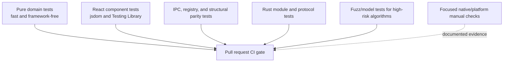
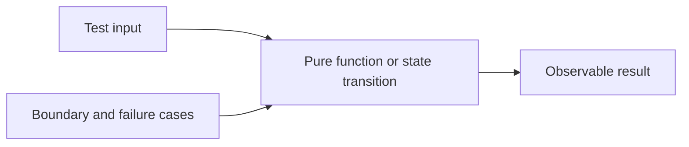
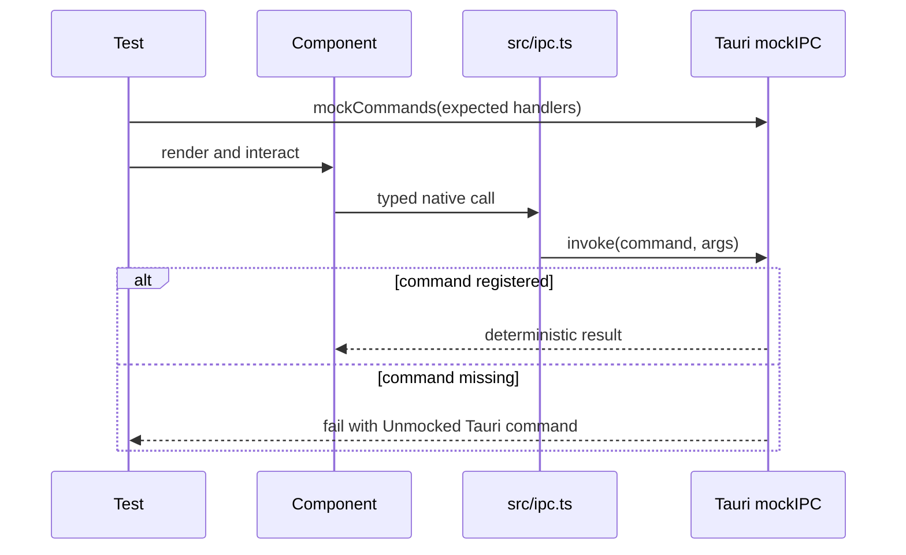
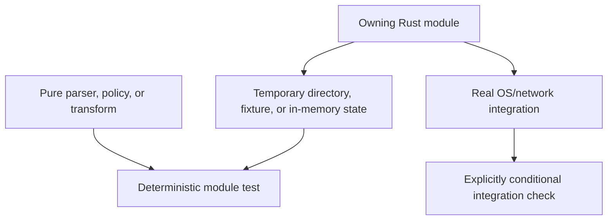
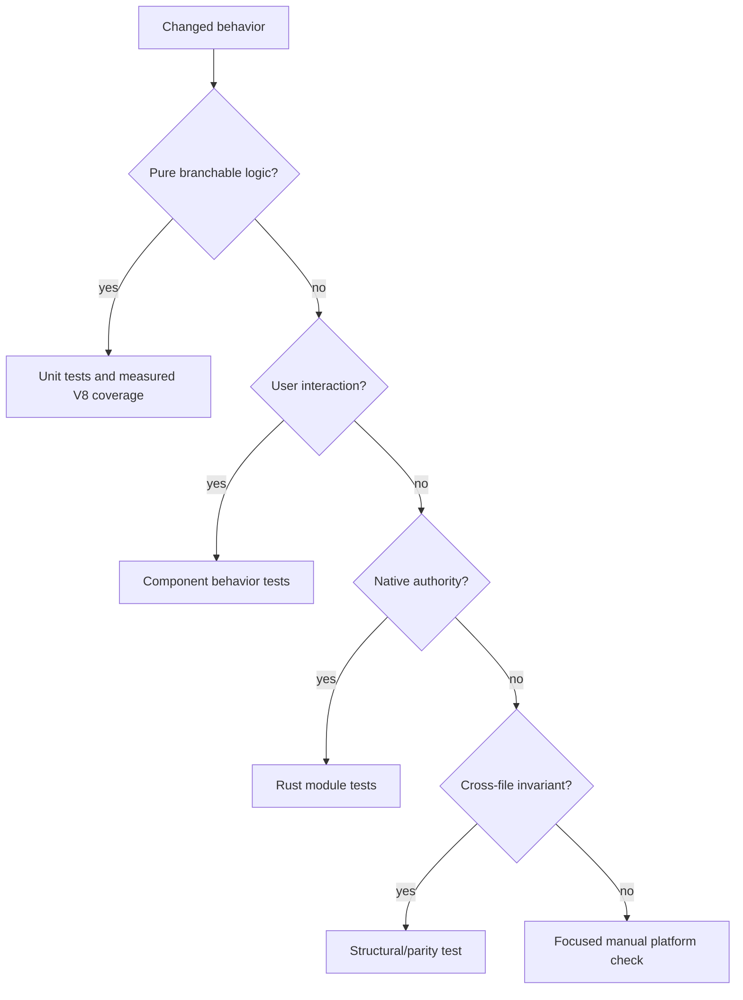
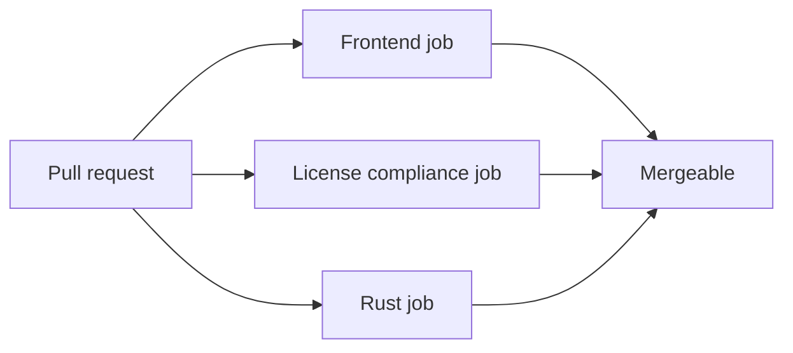

# Testing and Coverage

> This page describes Canopy's current test architecture and the expectations
> for new contributions. The contributor gate is also summarized in
> [CONTRIBUTING.md](../CONTRIBUTING.md).

## 1. Testing principles

Canopy is developed test-first. A behavior change should begin with a test that
fails for the intended reason, then pass after the smallest implementation.

The test belongs at the layer that owns the rule:

- pure TypeScript tests for domain policy and state transitions;
- React Testing Library tests for observable component behavior;
- structural tests for repository-wide dependency or parity constraints;
- Rust module tests for native validation, persistence, protocol, and cleanup;
- fuzz or model tests for algorithms where example cases are insufficient;
- focused manual checks for native rendering and platform behavior that jsdom
  cannot represent.

Tests should assert user or caller behavior, not internal implementation detail.

## 2. Test layers



This is not a conventional end-to-end browser pyramid. Canopy owns real PTYs,
native child WebViews, OS notifications, local servers, and system tools, so the
suite separates pure behavior from native ownership and tests each boundary at
the layer where it can be deterministic.

## 3. Frontend test system

Vitest is configured in `vitest.config.ts` with:

- `jsdom` as the environment;
- global test APIs;
- React's Vite transform;
- `src/test/setup.ts` as shared setup;
- the `@shared` alias used by the Remote application;
- tests under desktop, shared, Remote, and package source trees.

Included patterns:

```text
src/**/*.test.{ts,tsx}
shared/**/*.test.{ts,tsx}
portal/src/**/*.test.{ts,tsx}
packages/**/src/**/*.test.{ts,tsx}
```

Tests are colocated with the source they protect.

### 3.1 Pure domain tests

Prefer a framework-free module for logic that can be separated from React,
Monaco, xterm, Tauri, or the DOM.

Reference examples:

| Module | What it tests |
|---|---|
| `src/collab-ot.test.ts` | Operational transformation rules and convergence cases |
| `src/branchSync.test.ts` | Branch synchronization decisions |
| `src/spotCompose.test.ts` | Search-versus-composer classification |
| `src/fileOpen.test.ts` | File refusal and renderer policy |
| `src/channel.test.ts` | Observable channel notification semantics |
| `shared/agentLife/*.test.ts` | Agent lifecycle evidence and policy |



### 3.2 React component tests

Component tests use Testing Library and `@testing-library/user-event`. Assert
what the user can see, focus, click, type, dismiss, or navigate to.

Test:

- accessible labels and roles;
- keyboard and focus behavior;
- loading, empty, success, and error states;
- callbacks and rendered consequences;
- cleanup of listeners and async work;
- disabled and permission-gated behavior.

Do not assert private state, hook ordering, or exact internal component trees.

### 3.3 Tauri IPC mocking

`src/test/setup.ts` installs a rejecting default Tauri mock before every test.
Any unmocked native call fails loudly instead of hanging or silently returning
undefined.

```ts
mockCommands({
  git_repo_status: () => ({ branch: "main", changes: [] }),
})
```



Mock the boundary, not the feature's pure logic. Keep command names and payloads
aligned with `src/ipc.ts`.

### 3.4 Structural and parity tests

Some architectural rules are best tested by inspecting source rather than by
mounting a component.

Examples:

| Test | Constraint protected |
|---|---|
| `shared/sharedComponents.test.ts` | Shared code cannot import desktop IPC; shared components are not duplicated |
| `shared/remote/registry.test.ts` | Remote manifests, Rust grants, and stream providers agree |
| `portal/src/remote.test.ts` | Every listable Remote capability has a panel |
| `src/storeChangeGuard.test.ts` | Rust store variants have frontend invalidation handlers |
| `src/agentLifeGuard.test.ts` | Consumers use the shared lifecycle authority |
| `src/companionToolsGuard.test.ts` | Companion tool policy remains constrained |
| `src/overlayLayerGuard.test.ts` | Overlay/escape ownership remains centralized |
| `src/skins/skins.test.ts` | Every skin includes CSS, terminal, Monaco, and preview pieces |

These tests encode architecture, not formatting. Fix the mismatch rather than
adding an exemption because the test reads source text.

## 4. Rust test system

Rust tests live in `#[cfg(test)] mod tests` blocks beside the module they
protect. CI runs the crate with default features disabled:

```sh
cargo test --manifest-path src-tauri/Cargo.toml --no-default-features
```

This excludes the ONNX-backed dictation feature and matches a supported release
configuration. Native modules test:

- parsing and validation;
- path containment and identifier rejection;
- protocol encoding, limits, replay, and malformed input;
- Git outcome classification;
- atomic persistence and state transitions;
- PTY buffering and lifecycle rules;
- agent identity and integration configuration;
- Remote grants, scopes, streams, and verbs;
- relay encryption, transfer, and peer behavior;
- platform-independent portions of notifications, reminders, Android, and
  snapshot behavior.

### 4.1 Focused Rust iteration

Use a module filter while developing:

```sh
cargo test --manifest-path src-tauri/Cargo.toml --no-default-features git::tests
cargo test --manifest-path src-tauri/Cargo.toml --no-default-features relay::tests
cargo test --manifest-path src-tauri/Cargo.toml --no-default-features context::tests
```

Then run the full Rust test command before the pull request is ready.

### 4.2 Native test boundary



Prefer deterministic temporary resources. If a test touches an external server
or platform capability, make the unsupported/offline behavior explicit rather
than allowing an unexplained flaky failure.

## 5. Fuzzing and model tests

Operational transformation can silently diverge two documents even when all
ordinary examples pass. `scripts/collab-fuzz.mjs` complements
`src/collab-ot.test.ts` with generated edit sequences.

Use a fuzz or model test when:

- the input space is combinatorial;
- concurrency or ordering changes outcomes;
- round-trip or convergence is the invariant;
- a parser accepts attacker-controlled input;
- example tests cannot cover state-sequence interactions.

Record the random seed or failing input so a discovered failure becomes a
permanent deterministic regression test.

## 6. Coverage model

Coverage uses Vitest's V8 provider:

```sh
npm run test:coverage
```

The report is written to `coverage/`, which is ignored by Git.

### 6.1 Current measured scope

Coverage is intentionally targeted to these pure, high-value modules:

```text
src/collab-ot.ts
src/settings.ts
src/pricing.ts
src/markdown.ts
src/projects.ts
```

The project does **not** currently report whole-tree coverage. Monaco setup,
large composition components, IPC glue, platform adapters, and native surfaces
would otherwise dominate the report with misleading zeroes even though their
rules are tested at other layers.

There is currently no global line/branch/function percentage threshold in
`vitest.config.ts`, and CI does not run `npm run test:coverage`. Coverage is a
local diagnostic, while CI gates behavior tests, typechecking, lint, and Rust
tests.

This means a green build is not a claim of complete statement coverage. It is a
claim that the checked behavioral and architectural contracts passed.

### 6.2 When to add a module to measured coverage

Add a module to the coverage include list when it is:

- primarily pure logic;
- important enough that untested branches are meaningful;
- stable enough that a coverage trend is actionable;
- not mostly framework, generated, or transport glue.

Do not add a large UI composition file merely to increase a denominator. First
extract its risky policy into a testable domain module.

### 6.3 Coverage interpretation



Coverage percentage is one signal. The correct layer and assertion are more
important than a repository-wide number.

## 7. Pull request CI

CI runs on every pull request and push to `main`.



### Frontend job

```text
npm ci
npm run typecheck
npm run lint
npm run test
```

### License compliance job

```text
npm ci
npm run licenses:check
```

### Rust job

```text
cargo test --no-default-features
cargo fmt --all --check
cargo clippy --no-default-features --all-targets
```

Clippy is currently advisory in CI (`|| true`); tests and rustfmt are blocking.
The Rust job installs WebKit/GTK/ALSA build dependencies and stages an empty
hook-sidecar placeholder because Tauri validates `externalBin` during tests.

## 8. Test expectations by contribution

| Contribution | Required focused tests | Additional evidence |
|---|---|---|
| Theme | Skin completeness test | Visual inspection of app, terminal, Monaco, Remote |
| Shared component | Component behavior plus shared structural guard | Desktop and Remote rendering |
| Desktop feature | Pure domain and component behavior | Entry points, focus, cleanup |
| Project surface | Tab identity/switch/restore tests | Hide, close, hibernation behavior |
| Native capability | Rust validation/failure tests plus mocked frontend caller | Cleanup and unsupported-platform path |
| Agent tool | Context/sidecar auth and route tests | Disabled tool and timeout behavior |
| Search source | Registry, timing, failure isolation, and action tests | Settings disable behavior |
| Tracker | Provider normalization and ticket component behavior | Unauthorized/offline state |
| Agent CLI | Identity, fidelity, session, and integration tests | Verified CLI research evidence |
| Micro-task | Brief generation and settlement tests | Exit and cleanup behavior |
| Durable store | Rust path/atomic/state tests and frontend invalidation tests | Limit and corruption behavior |
| Remote feature | Manifest/grant/stream and panel parity tests | Scope denial and reconnect behavior |
| File viewer | Mapping, refusal, render, and cleanup tests | Corrupt and oversized files |
| Shortcut | TypeScript/Rust parity and platform-profile tests | Terminal collision behavior |
| Relay message | Rust protocol/limit/retry tests and UI behavior | Disconnect and malformed frame behavior |

## 9. Writing a useful regression test

1. Name the user-visible failure or invariant.
2. Reproduce the failure with the smallest fixture.
3. Confirm the test fails before changing production code.
4. Assert the observable outcome, including the negative case.
5. Avoid sleeps; use deterministic events, fake timers, or awaited state.
6. Mock only external boundaries.
7. Add the discovered edge case to a table-driven set when related cases exist.
8. Run the focused test during iteration.
9. Run the complete contributor gate before completion.

## 10. Contributor commands

Focused frontend test:

```sh
npm run test:watch -- src/collab-ot.test.ts
```

All frontend/shared/Remote/package tests:

```sh
npm run test
```

Targeted JavaScript coverage:

```sh
npm run test:coverage
```

Focused Rust module:

```sh
cargo test --manifest-path src-tauri/Cargo.toml --no-default-features git::tests
```

Full pull request gate:

```sh
npm run typecheck
npm run lint
npm run test
npm run build
cargo test --manifest-path src-tauri/Cargo.toml --no-default-features
```

## 11. Current gaps and honest limits

- Coverage is targeted, not repository-wide.
- CI does not currently enforce a numeric coverage threshold.
- CI does not run the coverage command.
- Native child-WebView visuals and OS integrations require focused platform
  checks in addition to unit tests.
- Release packaging and signing run in the release workflow, not pull request
  CI.
- Clippy warnings are reported but do not currently fail CI.
- There is no single end-to-end test that launches the complete packaged desktop
  application and drives every surface.

Contributions that close one of these gaps should improve signal without making
unrelated pull requests fail on unstable or platform-dependent infrastructure.
